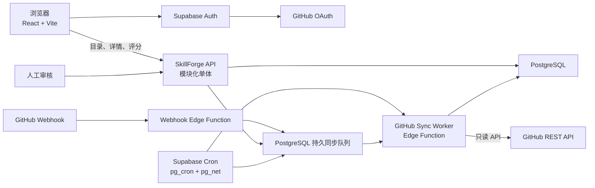
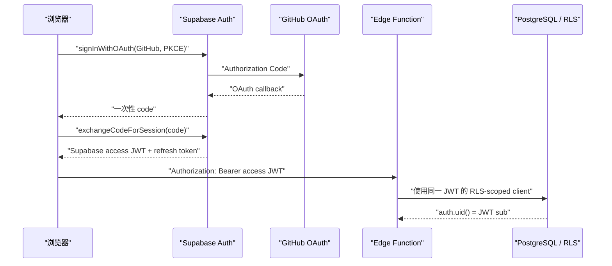
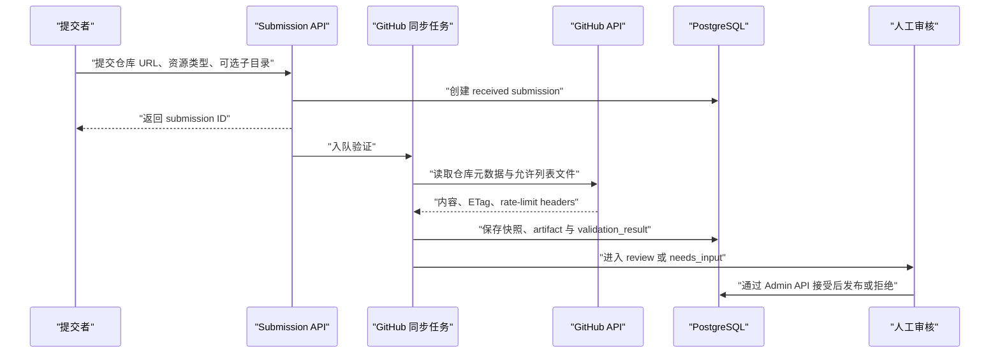

# SkillForge 系统架构

> 状态：架构基线，实施待办<br>
> 更新日期：2026-08-13<br>
> 范围：系统形态、分类模型、数据模型、API、GitHub 同步架构、既有原型页面迁移、容量与验收
> 产品范围、数据所有权与产品决策见唯一的 [产品权威](../authority/product.md)。

## 1. 结论

SkillForge 需要架构，但现在不需要微服务。推荐采用一个模块化单体：

- React + Vite 继续负责前端，静态站继续部署在 Netlify。
- PostgreSQL 保存目录、分类、评分、GitHub 快照和提交记录。
- Supabase Auth 负责 GitHub 登录；浏览器使用 Supabase access JWT 调用由 Edge Functions 承载的 API，不再建立第二套 SkillForge Session。
- GitHub App 以只读权限抓取仓库数据，通过定时同步和 Webhook 更新缓存快照。
- Supabase Cron 通过 `pg_cron + pg_net` 唤醒有时间预算的同步 Worker；Webhook 和页面请求只负责持久入队。
- 页面只读取 SkillForge 数据库中的组合结果，不在用户访问详情页时临时请求 GitHub。

如果以后把 API 改放到 Netlify Functions，下面的数据模型和 HTTP 合同不应改变。



## 2. 产品边界

产品范围、明确不做与事实展示规则只在 [产品权威：产品边界](../authority/product.md#1-产品边界) 维护。系统设计不得在此复制或覆写这些决策。

## 3. 当前代码基线与本轮范围

当前代码仍是静态前端基线，后续实现必须先承认这个边界：

- `src/data.js` 仍保存目录、详情、Bench、GitHub Stars、作者、科研套装、Planner 模板和演示评分，但只有 `LocalResourceRepository` 可读取它。
- `catalogIdentity.js` 已冻结 13 条资源和 13 个署名的独立 UUID/slug，并统一供应 13 学科与逐资源分类。其中 11 条属于旧原型迁移基线，2 条带人工采集的固定 commit 来源快照；它们都是本地候选，不是已发布数据库，也不代表运行验证。
- `LegacyTaxonomyAdapter` 只处理 `biology / computer-science / physics` 旧学科 URL；`biology` 回到无筛选首页，不会机械重定向为 `life-sciences`。旧资源和作者 slug 保持 canonical。
- 详情页和作者页只展示候选目录字段与明确证据状态；来源已定位候选还展示 revision-bound 的项目自述事实，运行验证仍明确为空。作者署名不是登录账号或资源维护权限的同义词。
- `/planner` 与 `/bench` 只渲染 retired page；`AgentScenariosSimulator` 仍是未挂载原型组件。
- `LoginPage.jsx`、`SubmitPage.jsx` 和 `AdminReviewPage.jsx` 明确显示未开放，没有认证、API 或持久化；当前 Netlify 配置只负责 Vite 静态构建与 SPA 重定向。

因此，当前页面上的静态 `rating`、`skillbench`、`githubStars`、安装人数、安全结论、兼容性和引用默认值都不能直接导入生产数据库作为真实事实。

本轮处置固定如下，避免“未迁移”被误解为“可以删除”：

| 产品面 | 当前状态 | 本轮处置 |
| --- | --- | --- |
| 首页、详情、提交、登录、作者署名 | 已挂载 | 纳入目标架构；逐步切到统一 repository/API |
| 社区五星评分、GitHub 同步 | 尚未实现 | 本轮设计并实施后端能力 |
| 作者页 | 源码已挂载 | 首版保留基础署名与已发布资源；累计引用、DOI 核验和论文使用等演示区隐藏 |
| Bench、兼容矩阵、学术信用与证据面板 | 静态演示已挂载 | 首版生产路由/区块关闭；保留源码，不导入演示事实，等独立证据合同上线再开放 |
| Planner、科研套装、旧学科详情 | 源码已挂载但不属于首版核心目录 | 首版生产路由/区块关闭；保留源码，不建立 pipeline、bundle 或 subcategory 的生产模型 |
| Agent 场景模拟器 | 未挂载原型 | 本轮范围外，不建立生产数据合同 |

首版生产路由策略不再二选一：`/planner`、`/bench` 保留显式 retired route，但原页面组件移出生产路由，访问时只显示明确的功能未开放页；科研套装不渲染。`/discipline/:legacyId` 只按版本化路由表处理：语义完全一致的旧 ID 跳转到首页 canonical field，`biology` 等一对多旧容器跳转到无筛选首页并提示“分类已更新”，绝不伪装成某一个新学科。`/author/:value` 先按 canonical slug 查询；仅未命中时查冻结的 legacy alias，且目标 slug 不同时才重定向，禁止自重定向。

taxonomy 迁移必须产出两张受测试、可删除的迁移清单，而不是再造第四套运行时分类：

```text
resource_slug, legacy_discipline_id, canonical_primary_field_id, canonical_field_ids[]
legacy_path, route_action(redirect_home|redirect_field|redirect_author|retired), target_path
```

Home、Detail、Submit、Author 与 API 切到 canonical taxonomy 后，生产前回归上述路由表；Planner、Bench、Bundles、legacy Discipline 保留源码但不再作为启用消费者，随后才可删除旧运行时定义。

另设一个独立的“演示事实清理”生产门：检查详情页、所有 Card 模式、AuthorPage、SubmitPage、LoginPage、Planner、Bench 和 DisciplinePage。必须移除假登录/假入队、静态 Bench、引用数、DOI 核验、兼容性、安装命令、“官方推荐”、自我进化、下载量、默认文件树与源码预览等无来源事实。兼容 adapter 只能供应已人工复核的目录字段与路由迁移信息。

## 4. 数据所有权与可信边界

数据域的唯一写入方、覆盖边界、API 命名空间与来源元数据只在 [产品权威：数据所有权与可信边界](../authority/product.md#2-数据所有权与可信边界) 维护。下面的 schema、API 和 Worker 设计必须满足该边界，但不能建立第二份权威说明。

## 5. 统一分类模型

“通用”在数据模型中是适用范围，不是学科；在首页筛选中与 13 个学科同层展示，并排在各学科之前。首页、详情、提交、API 和数据库必须共同使用一份分类来源。

### 5.1 适用范围

- `general`：不依赖某一学科对象或专门方法，可跨学科复用，例如通用文献检索、科研写作、引用管理和通用数据整理。
- `discipline`：针对一个或多个具体学科对象或方法。

学科专用的数据处理或可视化仍归相应学科，不能因为它包含“绘图”就归入 `general`。

### 5.2 顶层学科

当前统一为 13 个稳定 ID：

| ID | 中文名 |
| --- | --- |
| `life-sciences` | 生命科学 |
| `medicine-health` | 医学与健康 |
| `computer-science` | 计算机科学 |
| `mathematics-statistics` | 数学与统计 |
| `physics-astronomy` | 物理与天文 |
| `chemistry` | 化学 |
| `materials-science` | 材料科学 |
| `earth-environment` | 地球与环境 |
| `engineering-technology` | 工程技术 |
| `agricultural-sciences` | 农业科学 |
| `social-sciences` | 社会科学 |
| `humanities` | 人文 |
| `arts` | 艺术 |

分类不变量：

- `scope = general` 时，不允许主学科和关联学科。
- `scope = discipline` 时，必须有且只有一个主学科。
- 主学科必须出现在关联学科集合中。
- 资源可以有多个关联学科，但首页默认以同一资源 ID 去重。
- 无资源的学科仍可展示“收录中”，不能伪造资源数。

## 6. 目标数据模型

以下是最小逻辑模型。字段可以随实现调整，但实体边界和约束不应退回到单个静态对象。

### 6.0 计数器与版本术语

| 字段 | 所有者 | 递增时机 | 比较方 / 用途 |
| --- | --- | --- | --- |
| `resources.catalog_revision` | 单个 resource 及其人工目录聚合 | 人工目录字段、aliases/fields/tags/authors 关联、状态、primary source 或 maintainer 关系成功变更时，每事务最多一次 | Admin resource mutation 的 `expectedCatalogRevision` CAS |
| `fields.revision` / `tags.revision` | 单个 field/tag | 该实体成功修改时 | taxonomy/tag Admin mutation 的 `expectedRevision` CAS |
| `submission_review_drafts.revision` | 单个 submission 的人工草稿 | 草稿创建或成功更新时 | 以 `review` 为源状态的 review-draft/request-input/accept/reject/revalidate 使用 `expectedReviewRevision` CAS；草稿不存在时权威值为 `0` |
| `submissions.validation_epoch` / `catalog_validation_requests.validation_epoch` | 单个业务验证目标 | identity 改变、用户补充、Admin retry/revalidate 或 duplicate promotion 启动新验证轮次时 | 隔离旧 evidence 与队列 association；current result 必须等于当前 epoch |
| `github_*_jobs.generation` / `leased_generation` / junction `required_generation` | 单个持久队列 job | 每次新 trigger 创建或合并时 | Worker owner-CAS 与未消费 trigger 判定；详见 GitHub 同步规范 |
| `repositories.state_revision` | 单个 repository | latest/access 或未消费 sync trigger 集合变化时 | publication/reuse 与 source-lock 事务重读，防止新更新插入鲜度检查 |
| `catalog_search_state.current_revision` | 公开目录搜索投影 | 能改变 `published` 搜索/列表结果的目录事务成功时，每事务一次 | relevance cursor 绑定与过期检测 |
| `resource_search_documents.search_revision` | 单个公开搜索文档 | 文档跟随公开目录事务刷新时 | 必须等于生成该文档时的 `current_revision` |

`catalog_revision` 与全局搜索 revision 不是同一个值。GitHub snapshot、社区评分、Bench 写入、无语义变化的 projection rebuild/reconcile 不递增 resource 的 `catalog_revision`；作者或 tag 自身改名使公开文本变化时递增全局搜索 revision，但不伪造为每个引用 resource 的直接编辑。

### 6.1 目录与分类

```text
resources
- id UUID PRIMARY KEY
- slug TEXT UNIQUE NOT NULL（首次 published 后不可变）
- type ENUM(skill, mcp, plugin) NOT NULL（首次 published 后不可变）
- title TEXT NOT NULL
- summary TEXT NOT NULL
- description_md TEXT
- scope ENUM(general, discipline) NOT NULL
- status ENUM(draft, published, archived) NOT NULL
- curated_sort_order INTEGER NOT NULL DEFAULT 0
- catalog_revision BIGINT NOT NULL DEFAULT 1 CHECK(catalog_revision >= 1)
- created_at / updated_at NOT NULL
- published_at NULL

fields
- id TEXT PRIMARY KEY
- label_zh TEXT NOT NULL
- sort_order INTEGER NOT NULL
- active BOOLEAN NOT NULL
- revision INTEGER NOT NULL DEFAULT 1
- updated_at TIMESTAMPTZ NOT NULL

resource_fields
- resource_id UUID NOT NULL REFERENCES resources(id) ON DELETE CASCADE
- field_id TEXT NOT NULL REFERENCES fields(id) ON DELETE RESTRICT
- is_primary BOOLEAN NOT NULL
- PRIMARY KEY(resource_id, field_id)

resource_aliases
- resource_id UUID NOT NULL REFERENCES resources(id) ON DELETE CASCADE
- alias TEXT NOT NULL
- normalized_alias TEXT NOT NULL
- PRIMARY KEY(resource_id, normalized_alias)
- INDEX(normalized_alias, resource_id)

tags
- id TEXT PRIMARY KEY
- label_zh TEXT NOT NULL
- active BOOLEAN NOT NULL DEFAULT true
- revision INTEGER NOT NULL DEFAULT 1
- updated_at TIMESTAMPTZ NOT NULL

resource_tags
- resource_id UUID NOT NULL REFERENCES resources(id) ON DELETE CASCADE
- tag_id TEXT NOT NULL REFERENCES tags(id) ON DELETE RESTRICT
- PRIMARY KEY(resource_id, tag_id)

authors
- id UUID PRIMARY KEY
- slug TEXT UNIQUE NOT NULL（首次被 published 资源引用后不可变）
- entity_type ENUM(person, lab, organization, community) NOT NULL
- display_name TEXT NOT NULL
- affiliation TEXT NULL
- bio_md TEXT NULL
- homepage_url TEXT NULL
- source_url TEXT NULL
- verified_at TIMESTAMPTZ NULL
- status ENUM(active, archived) NOT NULL DEFAULT active
- archived_at TIMESTAMPTZ NULL
- created_at / updated_at NOT NULL

resource_authors
- resource_id UUID NOT NULL REFERENCES resources(id) ON DELETE CASCADE
- author_id UUID NOT NULL REFERENCES authors(id) ON DELETE RESTRICT
- role ENUM(creator, contributor, publisher) NOT NULL DEFAULT creator
- is_primary BOOLEAN NOT NULL DEFAULT false
- sort_order INTEGER NOT NULL DEFAULT 0
- PRIMARY KEY(resource_id, author_id, role)

resource_maintainers
- resource_id UUID NOT NULL REFERENCES resources(id) ON DELETE CASCADE
- profile_id UUID NOT NULL REFERENCES profiles(id) ON DELETE CASCADE
- role ENUM(owner, maintainer) NOT NULL
- valid_from TIMESTAMPTZ NOT NULL
- valid_to TIMESTAMPTZ NULL
- verified_at TIMESTAMPTZ NOT NULL
- verified_by UUID NULL REFERENCES profiles(id) ON DELETE SET NULL
- verification_method ENUM(admin_evidence) NOT NULL
- verification_reference TEXT NOT NULL
- PRIMARY KEY(resource_id, profile_id, valid_from)

resource_search_documents
- resource_id UUID PRIMARY KEY REFERENCES resources(id) ON DELETE CASCADE
- title_text TEXT NOT NULL
- alias_text TEXT NOT NULL DEFAULT ''
- author_text TEXT NOT NULL DEFAULT ''
- tag_text TEXT NOT NULL DEFAULT ''
- summary_text TEXT NOT NULL DEFAULT ''
- search_text TEXT NOT NULL
- search_revision BIGINT NOT NULL
- search_schema_version INTEGER NOT NULL
- updated_at TIMESTAMPTZ NOT NULL

catalog_search_state
- singleton BOOLEAN PRIMARY KEY DEFAULT true CHECK(singleton)
- current_revision BIGINT NOT NULL
- schema_version INTEGER NOT NULL
- updated_at TIMESTAMPTZ NOT NULL
```

`resources` 只存 SkillForge 管理的目录事实。GitHub README、Stars 和 Release 不写入这张表。

`resources.published_at` 首次发布后不清空；数据库 trigger 拒绝任何对已发布或曾发布资源的 `slug/type` 修改。若未来确需改类型，必须新增带 target revalidation、source lock、旧 URL/证据迁移的专用状态事务，不能放宽普通 PATCH。

数据库对分类再加两层约束：

- partial unique index 保证每个资源最多一个 `is_primary = true`。
- deferred constraint trigger 或同一事务内的等价校验保证：`discipline` 在事务结束时恰好一个主学科，`general` 没有任何 `resource_fields` 行。

主学科本身就是 `resource_fields` 中的一行，因此天然属于关联学科集合。分类删除使用 `RESTRICT`，先迁移资源再停用学科，不能级联抹掉分类事实。

`resource_maintainers` 对 `(resource_id, profile_id) WHERE valid_to IS NULL` 建 partial unique index，禁止同一用户出现重叠的当前维护关系；角色变更先关闭旧区间再建立新区间。首版不从 GitHub App installation、作者署名或 OAuth 登录自动推导维护者；只允许 active admin 根据可审计的外部证据手工建立、换角色或关闭关系。`verification_reference` 保存工单/公开证明 URL 或其他可重验引用，不得保存 Token 或私密正文。

`authors / resource_authors` 表达公开署名，可以是个人、实验室、机构或社区；`resource_maintainers` 表达已验证账号的管理权限和禁评资格。署名不自动授予维护权限，维护者也不自动成为作者。以后如需“认领作者”，另建带审核状态的 `author_profile_claims`，不能把 `authors` 强塞进 `profiles/auth.users`。

对 `resource_authors(resource_id) WHERE is_primary = true` 建 partial unique index；`published` 资源至少有一位作者且恰好一位 primary author。所有会改变 `resources.status`、`resource_authors` 或 `authors.status/source_url` 的事务均由 deferred constraint trigger 在结束时重验；任何被 published 资源引用的 author 必须持续满足 `status = active AND source_url IS NOT NULL`，不能在发布后清空来源或归档。`authors` 另加 CHECK：`active` 时 `archived_at IS NULL`，`archived` 时非空。多作者按 `sort_order, author_id` 稳定排序。

`resource_aliases` 与 `tags/resource_tags` 是可审计的 canonical 数据，搜索投影不能只保存无法追溯的拼接字符串。`resource_search_documents` 只为 `status = published` 的资源存在，并只由人工目录的标题、slug、别名、中文简介、标签和作者署名派生；`draft/archived` 资源必须没有投影行。第一版不把 GitHub README、topics、自动解析结果或 Bench 文本写入该投影。

所有目录写入都走受控数据库函数，并在同一事务中调用 `refresh_resource_search_document(resource_id)`：`published` 创建/更新投影，其他状态删除投影。作者或标签改名时刷新全部受影响的 published 资源。只有能改变公开搜索/列表结果的成功目录事务才递增 `catalog_search_state.current_revision`，且每事务只递增一次并写入受影响文档的 `search_revision`。草稿编辑、maintainer 变更和无语义差异的 rebuild 不使公开 cursor 过期。另提供可重复运行的全量 rebuild/reconcile 命令，部署和每日校验会比较 projection 与 canonical 表，投影漂移时告警且可重建。公开搜索 RPC 仍必须显式 join `resources` 并带 `resources.status = 'published'`，不把投影缺行当作唯一安全边界。

### 6.2 仓库与 GitHub 快照

GitHub 同步的列级 schema、状态机、事务边界、租约、额度算法、Worker 参数、访问撤销与保留策略只在 [GitHub 同步实现规范](github-sync.md) 维护。本节保留架构关系和不可退化不变量，不复制实现细节。

| 实体组 | 主要实体 | 架构职责 |
| --- | --- | --- |
| 身份与访问 | `repositories`、`github_installations`、`github_installation_repositories`、`resource_repositories` | 稳定仓库身份、授权状态、资源与仓库多对多关系 |
| 首次身份解析 | `github_repository_resolution_jobs`、`github_repository_resolution_attempts`、submission/catalog request 两类 resolution junction | 在没有 node ID 时持久解析 owner/repo，并把 submission 与 catalog preflight fan-in 到同一次 metadata lookup |
| 只读快照 | `github_snapshots`、`github_snapshot_parts`、`github_artifacts`、`resource_repository_artifacts` | 保存可追溯、可分项降级的 GitHub 读模型 |
| 执行链 | `github_sync_job_triggers → github_sync_jobs → github_sync_runs → github_snapshots` | 可计算的 trigger/generation 消费、持久队列、attempt 审计和原子快照发布 |
| Target 验证关联 | `github_sync_job_submissions`、`github_sync_job_catalog_requests` | 把 submission/catalog request 绑定到特定 sync generation，并区分 active/completed/detached 历史关联 |
| 入口与恢复 | `github_webhook_deliveries ↔ github_webhook_delivery_jobs`、`github_webhook_recovery_jobs/attempts`、redelivery requests | delivery GUID 去重、installation 事件、0..N repository fan-out 与有界投递恢复 |
| 控制面 | `repository_sync_policies`、`github_http_cache`、rate-limit buckets/reservations、worker invocations | 分层调度、条件请求、额度和 Worker 可观测性 |

不可退化不变量：

1. Source identity 由 repository、`root_path`、`manifest_path` 与 `manifest_internal_key` 共同表达；每个 published resource 恰有一个 primary repository。
2. 一次同步先固定 `head_sha`；同一 published snapshot 内不得混合不同 run、commit 或 repository 的数据。
3. Latest snapshot 只能在一个事务中晋升完整或明确允许的 partial 结果；失败 run 不得覆盖最后好快照。
4. Part/artifact 显式区分 `present/absent/reused/error/not_applicable`；tombstone 不回退旧内容，reused 必须有同仓库且有界的来源闭包。
5. job → run → snapshot → artifact → resource association 的 repository identity 必须由数据库约束闭合，不能只靠应用代码约定。
6. Webhook、Cron、submission 与 manual 请求只负责持久入队；delivery 去重、访问状态更新与 0..N fan-out 在同一事务完成。
7. Worker claim 是 repository resolution、sync 与 webhook recovery 的唯一 GitHub quota 权威；anonymous、installation 与 App 认证上下文隔离，installation Token 不得跨未授权仓库借用，App JWT 不得抓仓库正文。
8. Attempt 必须有界，lease 长于 attempt；owner-CAS 与 generation 防止过期 Worker 提交，也防止 leased 期间的新事件丢失。
9. 临时失败可以服务最后好快照；撤权、私有化、删除或身份不确定必须 fail closed，并按规范清理正文和已登记派生缓存。
10. Snapshot、artifact、run 与 job 的历史保留必须有容量上界；删除服从 retention closure 和外键顺序。

产品同步周期与页面承诺见第 9.5 节，抓取范围见第 9.2–9.4 节，容量与 SLO 见第 12 节；实现和验收都必须引用同一份 [GitHub 同步实现规范](github-sync.md)，不得在其他章节建立第二套队列或额度规则。

### 6.3 用户与评分

```text
profiles
- id UUID PRIMARY KEY REFERENCES auth.users(id) ON DELETE CASCADE
- submission_subject_key UUID UNIQUE NOT NULL DEFAULT gen_random_uuid()（内部伪名化键，不对外返回）
- github_user_id BIGINT UNIQUE NOT NULL
- github_login TEXT NOT NULL
- avatar_url TEXT
- role ENUM(user, editor, admin) NOT NULL DEFAULT user
- account_status ENUM(active, suspended) NOT NULL DEFAULT active
- status_changed_at TIMESTAMPTZ NOT NULL
- created_at / updated_at NOT NULL

ratings
- resource_id UUID NOT NULL REFERENCES resources(id) ON DELETE CASCADE
- user_id UUID NOT NULL REFERENCES profiles(id) ON DELETE CASCADE
- score SMALLINT NOT NULL CHECK(score BETWEEN 1 AND 5)
- status ENUM(active, excluded) NOT NULL DEFAULT active
- created_at / updated_at NOT NULL
- PRIMARY KEY(resource_id, user_id)

rating_stats
- resource_id UUID PRIMARY KEY REFERENCES resources(id) ON DELETE CASCADE
- rating_count INTEGER NOT NULL CHECK(rating_count >= 0)
- rating_sum INTEGER NOT NULL CHECK(rating_sum >= 0)
- star_1 / star_2 / star_3 / star_4 / star_5 INTEGER NOT NULL，各列 CHECK(value >= 0)
- updated_at TIMESTAMPTZ NOT NULL

rating_change_events
- id UUID PRIMARY KEY
- resource_id UUID NOT NULL REFERENCES resources(id) ON DELETE CASCADE
- user_id UUID NOT NULL REFERENCES profiles(id) ON DELETE CASCADE
- action ENUM(set, clear) NOT NULL
- request_id UUID NOT NULL
- changed_at TIMESTAMPTZ NOT NULL
- INDEX(request_id)
- INDEX(user_id, changed_at)
- INDEX(user_id, resource_id, changed_at)

rating_request_buckets
- user_id UUID NOT NULL REFERENCES profiles(id) ON DELETE CASCADE
- route_group TEXT NOT NULL DEFAULT 'rating-write'
- bucket_start TIMESTAMPTZ NOT NULL
- request_count INTEGER NOT NULL CHECK(request_count >= 0)
- PRIMARY KEY(user_id, route_group, bucket_start)
```

`rating_stats` 只汇总 `status = active` 的票。`ratings` 上的 `AFTER INSERT OR UPDATE OR DELETE FOR EACH ROW` trigger 是聚合 delta 的唯一写入口，并以 `OLD/NEW score + status` 正确增减 bucket；评分 RPC、维护者关系变更和账号级联删除都只修改 `ratings`，不得再直接重复修改 `rating_stats`。这样 auth user → profile → rating 的 FK cascade 也会经过同一个 DELETE trigger。只有 `OLD.score = requested_score AND OLD.status = desired_status` 才是 no-op；资格恢复后由用户明确确认产生的 `excluded → active` 即使分数相同也属于成功状态变更。首版不实现没有独立风控证据模型和复核入口的 `pending` 评分。

`resources` 的 `AFTER INSERT` trigger 为每个资源预建全零 `rating_stats` 行，bootstrap migration 先为存量资源补齐；评分 delta trigger 仍使用 `INSERT ... ON CONFLICT DO UPDATE` 并锁定统计行，避免部署回填窗口或异常缺行导致首票丢失。公开读模型以 `LEFT JOIN + COALESCE` 把迁移期间尚未补齐的零票资源显示为 `count = 0, average = null`，不能因此隐藏资源。

聚合还必须满足以下不变量，并检查所有计数非负：

```text
rating_count = star_1 + star_2 + star_3 + star_4 + star_5
rating_sum = 1*star_1 + 2*star_2 + 3*star_3 + 4*star_4 + 5*star_5
average = rating_sum / rating_count（读取时计算；count = 0 时为 null）
```

不在表里另存可漂移的 `average`，也不允许客户端直接写 `status` 或 `rating_stats`。

`rating_change_events` 只记录成功状态变更的时间与动作，不记录旧分、新分，也不对外提供评分动态；分数和目标状态都不变的幂等 PUT 不写 event，`excluded → active` 的重新确认则写 event。它为滚动 24 小时限流提供可审计计数，默认保留 30 天后删除，不能试图从只保存当前状态的 `ratings` 反推历史修改次数。

`request_id` 是 `account-api` 为每次评分写请求生成的 UUID correlation ID，只用于关联 API 日志与成功的状态变更事件，不是客户端幂等键，也不建立唯一约束。只有真正改变评分分数或状态并写入 `rating_change_events` 时才落表；分数和目标状态都不变、删除不存在评分、资格失败和限流不创建 change event，但 API 响应与结构化日志仍返回或记录同一个 request ID。

所有业务 advisory lock 都通过唯一的 `skillforge_advisory_key(domain, identity)` 生成 namespaced 64-bit key。首版固定登记 `rating-user`、`submission-user`、`submission-source` 与 `profile-governance` 四个 domain；任何路径都不得直接对裸 UUID、用户 ID 或 canonical key 取哈希后加锁。哈希碰撞最多造成额外串行，正确性仍由行锁、唯一约束和 deferred trigger 保证。

`mutate_rating` 在一个事务中按固定顺序执行：①取得 `rating-user:{actor_user_id}` advisory transaction lock；②以行锁读取目标 `resources`，只允许 `status = published`，否则按公开不存在返回 `404 resource_not_found`；③要求 actor 对应 profile 仍存在且 `account_status = active`，并查询当前有效且已验证的 `resource_maintainers`，命中则返回 `403 self_rating`；④以行锁读取当前 `ratings` 行并计算目标状态，分数与目标状态均不变的 PUT 直接返回成功，删除不存在评分直接返回 `204`；这两类 no-op 都不进入滚动状态变更限流；⑤只对真正的状态变更检查滚动 24 小时“同资源最多 5 次”和“最多 50 个不同资源”；⑥修改 `ratings`，由 trigger 原子更新 `rating_stats`，并写入带 `request_id` 的 `rating_change_events`。任一步失败整笔回滚。这不影响 account-api 在独立事务中消费每分钟请求 bucket：no-op 仍是一次 HTTP 请求，只不是一次成功评分状态变更。

`profiles.account_status` 是 SkillForge 写操作的账号资格权威；封禁/解封只能由 admin RPC 修改并记录审计。Suspended 事务在 governance lock 后取得该用户的 `rating-user` lock，把其 active 评分改为 `excluded` 并由 trigger 扣减公开聚合；恢复 active 不自动恢复旧票。Auth user 被删除时 profile 会级联删除，尚未过期的旧 JWT 因找不到 active profile 而无法评分或提交；业务函数不直接依赖未公开的 Auth schema 内部字段。

所有新增、验证、变更或关闭当前 `resource_maintainers` 关系的事务，也必须先取得同一个 `rating-user:{profile_id}` 锁。关系生效时，在同一事务把该用户已有评分改为 `excluded` 并扣减公开聚合；关系结束时不自动恢复旧票。这样评分写入与维护者资格变化不能并发留下仍计入聚合的本人评分。

短窗请求限流与状态变更限流分开，但唯一 mutation 入口必须是 `account-api`。该 Function 验证 Supabase JWT 后取得 `actor_user_id`，再通过受池化直连使用专用数据库角色 `skillforge_rating_api`：这个角色只能 EXECUTE `consume_rating_request_bucket` 与 `mutate_rating(actor_user_id, resource_id, score/action, request_id)` 两个 private-schema 函数，不能读写任意业务表。先原子消费 `rating_request_buckets`（默认每用户每 UTC 分钟 30 个 rating write 请求），再调用 mutation；短窗 bucket 独立提交，不能因后续评分失败而回滚。mutation 只使用显式 actor 做 profile/account 状态校验、user advisory lock、ratings/events 归属和 5/50 检查，并记录 account-api 生成并传入的 request ID；不读取 `auth.uid()`。数据库连接 Secret 只配置给 account-api，不共享给 admin/webhook/worker。bucket 保留 48 小时后清理，阈值可配置。

### 6.4 提交与 Bench

```text
submissions
- id UUID PRIMARY KEY
- submitter_id UUID NULL REFERENCES profiles(id) ON DELETE SET NULL
- submitter_subject_key UUID NOT NULL（接收时复制 profiles.submission_subject_key，账号删除时改为行级 tombstone）
- repository_url TEXT NOT NULL
- repository_url_fingerprint TEXT NOT NULL（仅用于早期提示、限流与验证任务合并）
- resolved_repository_id UUID NULL REFERENCES repositories(id) ON DELETE RESTRICT
- claimed_type ENUM(skill, mcp, plugin) NOT NULL
- claimed_resource_path TEXT NULL
- claimed_manifest_path TEXT NULL
- claimed_internal_key TEXT NULL
- idempotency_key_hash BYTEA NOT NULL
- request_payload_sha256 TEXT NOT NULL
- dedupe_key TEXT NOT NULL（初始为 provisional key，只有 valid validation 后才替换为 canonical key）
- dedupe_key_kind ENUM(provisional, canonical) NOT NULL DEFAULT provisional
- candidate_dedupe_key TEXT NULL（resolution 后计算的候选 source identity；不参与唯一 winner 约束）
- validation_epoch INTEGER NOT NULL DEFAULT 1 CHECK(validation_epoch >= 1)
- current_validation_result_id UUID NULL REFERENCES github_submission_validation_results(id) ON DELETE RESTRICT
- current_validation_epoch INTEGER NULL
- status ENUM(received, validating, validation_failed, needs_input, review, accepted, rejected, duplicate, expired) NOT NULL
- duplicate_of_submission_id UUID NULL REFERENCES submissions(id) ON DELETE RESTRICT
- duplicate_of_resource_id UUID NULL REFERENCES resources(id) ON DELETE RESTRICT
- validation_result JSONB
- created_at / updated_at NOT NULL
- UNIQUE(submitter_subject_key, idempotency_key_hash)
- INDEX(submitter_id, created_at)
- INDEX(repository_url_fingerprint, created_at)
- 对 canonical dedupe_key 建 partial unique index：status IN (received, validating, review) AND dedupe_key_kind = canonical
- status = duplicate 时两个 duplicate target 恰好一个非空；其他状态两者都为空
- duplicate_of_submission_id IS NULL OR duplicate_of_submission_id <> id
- CHECK((current_validation_result_id IS NULL AND current_validation_epoch IS NULL) OR (current_validation_result_id IS NOT NULL AND current_validation_epoch = validation_epoch))
- CHECK((dedupe_key_kind = provisional AND dedupe_key = 'pending:' || id::text) OR (dedupe_key_kind = canonical AND dedupe_key LIKE 'github:%'))
- CHECK(status NOT IN ('validation_failed', 'needs_input', 'rejected', 'expired') OR dedupe_key_kind = provisional)
- CHECK(status NOT IN ('review', 'accepted', 'duplicate') OR dedupe_key_kind = canonical)
- CHECK(status <> 'review' OR current_validation_result_id IS NOT NULL)
- CHECK(status <> 'duplicate' OR resolved_repository_id IS NOT NULL)

benchmark_results
- id UUID PRIMARY KEY
- resource_id UUID NOT NULL REFERENCES resources(id) ON DELETE RESTRICT
- benchmark_id TEXT NOT NULL
- benchmark_version TEXT NOT NULL
- source_revision TEXT NOT NULL
- score NUMERIC
- metrics JSONB
- methodology_url TEXT
- evidence_url TEXT
- run_at TIMESTAMPTZ NOT NULL
- status ENUM(unverified, verified, superseded) NOT NULL
```

首次接收提交时尚未取得 GitHub repository node ID，因此使用只属于该行的 provisional key `pending:{submission_id}` 和 `dedupe_key_kind = provisional`；它只是满足持久化与状态机要求的占位符，不代表 source identity。Canonical key 使用有版本的 `github:{provider_node_id}:{normalized root/manifest/internal key}` 编码并配 `dedupe_key_kind = canonical`；约束不依赖字符串 `NOT LIKE` 猜测类型。规范化 GitHub URL fingerprint 可以用于早期提示、账号/仓库限流和验证任务合并，但不能充当 canonical dedupe key。

解析得到 `node ID + root path + manifest path + internal key` 后，只把规范化 identity 写入 `candidate_dedupe_key`，`dedupe_key` 仍保持 `pending:{submission_id}`。系统先对该 submission 的精确 repository/root/manifest/internal-key/type 生成 validation result；`needs_input` 结果保留 provisional key，不能占用 canonical winner，也不能把后到的正确候选直接变成 duplicate。只有 `result_state = valid` 时，完成事务才取得 `submission-source:{candidate_dedupe_key}` advisory lock并检查非删除 resource 与已验证活动 winner：没有 winner 时把本行 `dedupe_key` 原子改为 canonical 并进入 `review`；已有活动 winner 时把本行改为 `duplicate` 并填 submission target；已有 resource 时同理填 resource target。只有目标为 `published` 才向提交者返回公开链接；`draft/archived` 目标统一显示“已在内部目录处理中”，不能泄露未发布资料。这样错误 type/path 的首报不能锁死正确后报，raw URL 与未经验证的 source candidate 都不构成目录身份。

canonical dedupe key 在 valid validation 的完成事务内重算后，如撞到另一条已验证活动 submission，本条进入 `duplicate` 并在内部指向该 submission；如撞到已占用 source identity 的 resource，则在内部指向该 resource。validation-complete/dedupe、accept+publish、request-input/reject/promote、identity PATCH、catalog import 与 draft publish 路径必须取得由同一个 `submission-source:{canonical_key}` 经 `skillforge_advisory_key` 派生的 advisory transaction lock。deferred trigger 还要保证 submission target 与 duplicate 具有同一 canonical dedupe key、二者 `resolved_repository_id` 一致、目标处于 active 非 duplicate 状态，并禁止 duplicate 链或环；resource target 必须真实持有同一 primary source identity。提交者查询审核中重复或未发布 resource target 时只看到“已有内部记录”，不能获得目标 ID 或审核内容；只有指向 `published` resource 时可以返回公开链接。`rejected` 只用于政策或质量失败，不能拿来掩盖并发去重。

GitHub source 相关事务还必须共享 repository-state 串行化：sync enqueue/merge、latest snapshot 晋升、access/visibility 变化、validation reuse 绑定、accept/publish/import 都先以固定顺序锁定涉及的 `repositories` 行并重读 `state_revision`，再按排序后的 canonical key 取得 `submission-source` advisory lock，最后锁 submission/resource 等业务行。每次 latest/access 或未消费 sync trigger 集合变化都递增 `state_revision`。任何路径都不能先锁 source/业务行再反向等待 repository 行；这样 freshness 检查和发布之间不能插入 webhook、Cron、撤权或新 snapshot。

所有触及 GitHub source identity 的事务使用同一锁序；实现不得按调用入口另定顺序：

| 顺序 | 锁对象 | 同层排序与重读要求 |
| --- | --- | --- |
| 1 | 涉及的 `repositories` 行锁 | 按 repository UUID 升序；加锁后重读 `state_revision`、latest、visibility 与 access state |
| 2 | `submission-source:{canonical_key}` advisory transaction lock | 多个 key 按规范化 UTF-8 字节升序，经 `skillforge_advisory_key` 派生 |
| 3 | `resources`、winner submission 与 duplicate submission 业务行锁 | resource 按 UUID 升序，submission 按 `created_at, id`；重验 status、epoch、key kind 与 target |
| 4 | validation association、搜索投影与审计子行 | 只能在前三层完成后写入，不得反向取得 repository/source 锁 |

事务可以在加锁前做无副作用读取来解析待锁集合，但必须在取得全部锁后重新读取并比较权威状态；集合变化则回滚重试，不能沿用预读结果。

目标 submission 被接受时，同一发布事务把所有指向它的 duplicate 改为 `duplicate_of_resource_id` 并清空 submission pointer。已验证 winner 进入 `needs_input/rejected/validation_failed/expired` 或改变 source identity时，事务先从 winner 解析 repository并按全局顺序锁 repository 行，再取得旧 canonical lock，最后锁 winner/duplicates；随后把 winner 的 `dedupe_key` 恢复为自身 provisional key并清空 current evidence，从而释放旧唯一键，再按 `created_at, id` 提升最早一条 duplicate。Canonical duplicate 必须已经有与 winner 一致的 `resolved_repository_id`；提升事务先清空 successor 的 `current_validation_result_id/current_validation_epoch/validation_result`，再清 target、递增 `validation_epoch`、创建或合并本 epoch 的普通 sync work并写 active association，随后才把它置为 `received` 并继续占用旧 canonical key，其余 duplicate 原子改指。禁止把整组 canonical duplicate 改成互不相同的 provisional key，也不存在“无 resolved repository 再做 resolution”的分支。目标行受 `ON DELETE RESTRICT` 保护，资源用 `archived` 退役，因此 `duplicate` 的“恰好一个 target”约束不会被删除动作破坏。

`review → received` 的 revalidate 不表示 source identity 失效：winner 在同一 canonical lock 下保留 canonical `dedupe_key`、人工 review draft 和所有指向它的 duplicate，只递增自身 `validation_epoch`、清 current evidence、完成/detach 旧 association 并持久化新 sync work。新 valid result 完成时应识别“当前 canonical winner 就是本行”并恢复 `review`，不得把自身判成 duplicate。

所有 provisional/canonical 转换都在同一 SQL 语句或同一 deferred-constraint 事务中同时更新 `dedupe_key + dedupe_key_kind`；恢复 `pending:{id}` 必须设为 `provisional`，竞争/保留 canonical key 必须设为 `canonical`。不允许两列短暂或最终不一致。

`status × dedupe_key_kind` 的首版合法组合固定如下；未列出的组合由 CHECK/deferred trigger 拒绝：

| Submission status | 合法 key kind | 说明 |
| --- | --- | --- |
| `received` / `validating` | `provisional` 或 `canonical` | 首次解析/验证使用 provisional；winner revalidate 或 duplicate promotion 后的新验证保留 canonical |
| `validation_failed` / `needs_input` / `rejected` / `expired` | `provisional` | 原 canonical winner 进入这些状态前必须先释放 key，并在同一事务完成 duplicate promotion |
| `review` | `canonical` | 已有当前 epoch 的 valid result，且是该 source 的活动 winner |
| `accepted` | `canonical` | 发布后 source identity 由 resource 持有；指向 submission 的 duplicates 已改指 resource |
| `duplicate` | `canonical` | 必须恰好指向同 canonical identity 的一个活动 submission 或未物理删除 resource |

其中 `received/validating + canonical` 只允许已有 winner 的 revalidate 或 promotion 路径产生；普通新 submission 不能跳过 valid validation 直接占用 canonical key。实现应把这张矩阵编码为数据库约束和逐转换状态机测试，不能只靠 API 分支约定。

`create_submission(...)` 取得 `submission-user:{submitter_id}` 锁后，重验 profile 仍存在且 `account_status = active`，从 profile 复制内部 `submission_subject_key`，并在同一事务完成 idempotency lookup、滚动窗口检查和 submission INSERT。默认每账号最多成功接收 3 次/分钟、10 次/滚动 24 小时；阈值配置化，只计算真正新建的 submission，相同 subject key、idempotency key 与相同 payload 的重放返回原结果且不重复计数，key 相同但 payload 不同返回 `409 idempotency_conflict`。仓库级策略只限制昂贵 GitHub validation attempt，而不是锁死所有人的 POST；不同 monorepo 资源保留各自 submission，是否复用既有 target-level validation coverage、何时必须新抓取只按同步规范执行。

Submission API 不直接调用 GitHub。首次提交先按 `submission_id + repository_url_fingerprint` 进入 [repository resolution queue](github-sync.md#21-repository-resolution)，由同一 Worker quota 权威执行固定 GitHub metadata lookup；取得稳定 node ID 并原子绑定 `resolved_repository_id` 后，才进入普通 repository sync。首次成功 claim 前或 quota defer 时 submission 保持 `received` 并显示等待；attempt 已启动后的临时 retry 才保持 `validating`，两者都不伪装成验证失败。账号 admission 只控制请求接收，仓库 validation window 只控制昂贵 attempt，二者都不能绕过 Worker claim 的全局额度权威。

临时错误在普通 retry 期间保持 `validating`，提交查询返回安全的 `retryAfter`；耗尽 `max_attempts` 后，dead-job reconciler 在同一事务把受影响 submission 改为 `validation_failed`、写公开错误码和 review event，并在 canonical lock 内按与 reject 相同的规则处理现有 duplicate。Editor/admin 可以通过受控 retry API 执行 `validation_failed → received`；用户可修复的问题始终进入 `needs_input`。任何自动路径都不能进入 `rejected`。

Bench 没有独立证据时不展示结果，不能根据 README 或 GitHub 活跃度自动生成。`ON DELETE RESTRICT` 用于保留已引用的审计记录；资源退役使用 `archived`，不物理删除其验证过的 Bench 归属。

### 6.5 编辑、审核与存量导入

首版必须提供可操作的审核闭环。编辑或管理员不能直接修改业务表，也不能通过 Supabase Dashboard 绕过审核状态机；内部工作台和自动化脚本都只能调用同一组 Admin API 与数据库事务函数。

角色与权限固定为：

| 角色 | 能力 |
| --- | --- |
| `user` | 创建提交、查看自己的提交、在 `needs_input` 状态补充资料 |
| `editor` | 查看审核队列和详情、编辑候选目录字段、维护作者/tag 内容、要求补充资料、接受或拒绝提交、触发单仓库同步 |
| `admin` | 拥有 editor 能力，并可发布存量 draft、管理角色与账号状态、停用 taxonomy、执行存量导入及紧急归档已发布资源 |
| `system` | 执行仓库解析和校验，只能推进自动状态，不能接受、拒绝或发布资源 |

所有 editor/admin 操作都由 `admin-api` 验证 Supabase JWT，再由数据库 RPC 在同一事务内通过 `auth.uid()` 重验 `account_status = active` 与当前 `profiles.role`；每条路由使用下文最小角色矩阵，不能把整个 `/api/internal/admin/*` 简化成统一的 `editor OR admin`。前端隐藏按钮不构成权限控制。

编辑过程中使用独立候选草稿，不能直接修改正式目录表：

```text
submission_review_drafts
- submission_id UUID PRIMARY KEY REFERENCES submissions(id) ON DELETE CASCADE
- revision INTEGER NOT NULL CHECK(revision >= 1)
- payload JSONB NOT NULL
- edited_by UUID NULL REFERENCES profiles(id) ON DELETE SET NULL
- updated_at TIMESTAMPTZ NOT NULL

admin_commands
- request_id UUID PRIMARY KEY
- actor_profile_id UUID NULL REFERENCES profiles(id) ON DELETE SET NULL
- actor_role_at_time ENUM(editor, admin) NOT NULL
- route_key TEXT NOT NULL（仅用于权限注册表，例如 resource.publish-draft）
- target_key TEXT NOT NULL（HTTP method + route template + 规范化 path params）
- request_payload_sha256 TEXT NOT NULL
- response_json JSONB NULL
- response_sha256 TEXT NULL
- result_code TEXT NULL
- completed_at TIMESTAMPTZ NULL
- created_at TIMESTAMPTZ NOT NULL

review_events
- id UUID PRIMARY KEY
- submission_id UUID NULL REFERENCES submissions(id) ON DELETE RESTRICT
- resource_id UUID NULL REFERENCES resources(id) ON DELETE RESTRICT
- actor_type ENUM(user, editor, admin, system) NOT NULL
- actor_profile_id UUID NULL REFERENCES profiles(id) ON DELETE SET NULL
- actor_role_at_time TEXT NULL
- event_type ENUM(
    submitted,
    validation_started,
    validation_completed,
    validation_failed,
    validation_retried,
    review_draft_updated,
    input_requested,
    input_resubmitted,
    accepted,
    rejected,
    expired,
    duplicate_marked,
    duplicate_promoted,
    catalog_updated
  ) NOT NULL
- from_status TEXT NULL
- to_status TEXT NULL
- reason_code TEXT NULL
- message TEXT NULL
- review_revision INTEGER NULL
- snapshot_id UUID NULL REFERENCES github_snapshots(id) ON DELETE RESTRICT
- validation_result_id UUID NULL REFERENCES github_submission_validation_results(id) ON DELETE RESTRICT
- snapshot_head_sha TEXT NULL
- snapshot_summary_sha256 TEXT NULL
- command_request_id UUID NULL REFERENCES admin_commands(request_id) ON DELETE RESTRICT
- causation_event_id UUID NULL REFERENCES review_events(id) ON DELETE RESTRICT
- created_at TIMESTAMPTZ NOT NULL
- CHECK(submission_id IS NOT NULL OR resource_id IS NOT NULL)
- CHECK((event_type = accepted AND snapshot_id IS NOT NULL AND validation_result_id IS NOT NULL) OR (event_type <> accepted AND snapshot_id IS NULL AND validation_result_id IS NULL))
- FOREIGN KEY(validation_result_id, snapshot_id) REFERENCES github_submission_validation_results(id, snapshot_id) ON DELETE RESTRICT

profile_role_events
- id UUID PRIMARY KEY
- profile_id UUID NULL REFERENCES profiles(id) ON DELETE SET NULL
- old_role ENUM(user, editor, admin) NOT NULL
- new_role ENUM(user, editor, admin) NOT NULL
- actor_type ENUM(bootstrap, admin) NOT NULL
- actor_profile_id UUID NULL REFERENCES profiles(id) ON DELETE SET NULL
- command_request_id UUID NULL REFERENCES admin_commands(request_id) ON DELETE RESTRICT
- bootstrap_request_id UUID NULL UNIQUE
- reason_code TEXT NOT NULL
- reason_text TEXT NULL
- reason_sha256 TEXT NOT NULL
- created_at TIMESTAMPTZ NOT NULL
- CHECK((actor_type = bootstrap AND bootstrap_request_id IS NOT NULL AND command_request_id IS NULL) OR (actor_type = admin AND bootstrap_request_id IS NULL AND command_request_id IS NOT NULL))

profile_status_events
- id UUID PRIMARY KEY
- profile_id UUID NULL REFERENCES profiles(id) ON DELETE SET NULL
- old_status ENUM(active, suspended) NOT NULL
- new_status ENUM(active, suspended) NOT NULL
- actor_profile_id UUID NULL REFERENCES profiles(id) ON DELETE SET NULL
- command_request_id UUID NOT NULL REFERENCES admin_commands(request_id) ON DELETE RESTRICT
- reason_code TEXT NOT NULL
- reason_text TEXT NULL
- reason_sha256 TEXT NOT NULL
- created_at TIMESTAMPTZ NOT NULL

catalog_admin_events
- id UUID PRIMARY KEY
- entity_type ENUM(resource, resource_maintainer, author, tag, field) NOT NULL
- entity_key TEXT NOT NULL
- event_type ENUM(created, updated, published, archived, activated, deactivated) NOT NULL
- actor_profile_id UUID NULL REFERENCES profiles(id) ON DELETE SET NULL
- command_request_id UUID NOT NULL REFERENCES admin_commands(request_id) ON DELETE RESTRICT
- evidence_snapshot_id UUID NULL REFERENCES github_snapshots(id) ON DELETE RESTRICT
- evidence_validation_result_id UUID NULL REFERENCES github_submission_validation_results(id) ON DELETE RESTRICT
- evidence_head_sha TEXT NULL
- evidence_summary_sha256 TEXT NULL
- before_sha256 TEXT NULL
- after_sha256 TEXT NOT NULL
- reason_code TEXT NULL
- reason_text TEXT NULL
- reason_sha256 TEXT NULL
- created_at TIMESTAMPTZ NOT NULL
- CHECK((event_type = published AND entity_type = resource AND evidence_snapshot_id IS NOT NULL AND evidence_validation_result_id IS NOT NULL) OR (event_type <> published AND evidence_snapshot_id IS NULL AND evidence_validation_result_id IS NULL))
- FOREIGN KEY(evidence_validation_result_id, evidence_snapshot_id) REFERENCES github_submission_validation_results(id, snapshot_id) ON DELETE RESTRICT

catalog_import_batches
- id UUID PRIMARY KEY
- schema_version INTEGER NOT NULL
- manifest_sha256 TEXT UNIQUE NOT NULL
- applied_by UUID NULL REFERENCES profiles(id) ON DELETE SET NULL
- command_request_id UUID NOT NULL REFERENCES admin_commands(request_id) ON DELETE RESTRICT
- input_count INTEGER NOT NULL
- draft_count INTEGER NOT NULL
- published_count INTEGER NOT NULL
- excluded_count INTEGER NOT NULL
- report JSONB NOT NULL
- applied_at TIMESTAMPTZ NOT NULL
- CHECK(input_count = draft_count + published_count + excluded_count)

catalog_import_receipts
- manifest_sha256 TEXT PRIMARY KEY
- schema_version INTEGER NOT NULL
- result_sha256 TEXT NOT NULL
- first_batch_id UUID NULL REFERENCES catalog_import_batches(id) ON DELETE SET NULL
- retired_at TIMESTAMPTZ NULL
- created_at TIMESTAMPTZ NOT NULL

catalog_validation_requests
- id UUID PRIMARY KEY
- request_kind ENUM(import_item, draft_resource) NOT NULL
- manifest_sha256 TEXT NULL
- manifest_item_key TEXT NULL
- resource_id UUID NULL REFERENCES resources(id) ON DELETE RESTRICT
- requested_by UUID NULL REFERENCES profiles(id) ON DELETE SET NULL
- repository_url TEXT NOT NULL
- repository_url_fingerprint TEXT NOT NULL
- claimed_type ENUM(skill, mcp, plugin) NOT NULL
- claimed_resource_path TEXT NULL
- claimed_manifest_path TEXT NULL
- claimed_internal_key TEXT NULL
- validation_epoch INTEGER NOT NULL DEFAULT 1 CHECK(validation_epoch >= 1)
- resolved_repository_id UUID NULL REFERENCES repositories(id) ON DELETE RESTRICT
- current_validation_result_id UUID NULL REFERENCES github_submission_validation_results(id) ON DELETE RESTRICT
- current_validation_epoch INTEGER NULL
- status ENUM(received, validating, needs_input, valid, validation_failed, consumed, expired) NOT NULL
- created_at / updated_at / expires_at TIMESTAMPTZ NOT NULL
- CHECK((request_kind = import_item AND manifest_sha256 IS NOT NULL AND manifest_item_key IS NOT NULL) OR (request_kind = draft_resource AND resource_id IS NOT NULL))
- CHECK((current_validation_result_id IS NULL AND current_validation_epoch IS NULL) OR (current_validation_result_id IS NOT NULL AND current_validation_epoch = validation_epoch))
- partial UNIQUE(manifest_sha256, manifest_item_key, validation_epoch) WHERE request_kind = import_item
- partial UNIQUE(resource_id) WHERE request_kind = draft_resource AND status IN (received, validating, needs_input, valid, validation_failed)
```

review draft 的 `payload` 只允许保存准备进入人工目录的数据，例如标题、简介、类型、scope、field、tags、authors 和主仓库关联，并使用版本化 JSON Schema 校验。GitHub Stars、README 正文、社区评分、Bench、安全结论等其他数据域不能混入。以 `review` 为源状态的 review-draft/request-input/accept/reject/revalidate 统一使用 `expectedReviewRevision` 做乐观并发控制；权威值为 `COALESCE(submission_review_drafts.revision, 0)`，因此系统刚进入 `review` 且尚无草稿时 request-input/revalidate 传 `0`。版本不匹配返回 `409 review_revision_conflict`。Accept 额外要求 revision 至少为 1 且草稿存在。`validation_failed → received` 的 retry-validation 不以草稿 revision 为 CAS，只比较 `expectedStatus` 和 validation epoch。

删除 Auth user 时允许 `profiles` 按 FK 级联删除：评分与维护关系随之删除或关闭，submission、草稿和管理审计中的 profile 引用统一置空，不能由审计表上的 `RESTRICT` 阻断账号删除。删除事务把该账号每条 submission 的 `submitter_subject_key` 改成彼此独立、不可反查个人资料的随机 tombstone；它只维持行和唯一索引有效，不再承诺跨请求历史幂等或账号关联。删除后的账号不能读取旧提交，重新注册视为新主体。`admin_commands.actor_role_at_time` 和各事件中的变更前后值继续保存当时的决策语义，但接口不再返回已删除账号的个人资料。

首版 `review-draft`/`accept_submission` 共用以下版本化入参形状；可选字段可以为空，但不能由接口临时增加未登记的数据域：

```json
{
  "schemaVersion": 1,
  "resource": {
    "slug": "example-skill",
    "type": "skill",
    "title": "Example Skill",
    "summary": "人工编辑简介",
    "descriptionMd": null,
    "aliases": ["ExampleSkill"],
    "scope": "discipline",
    "primaryFieldId": "life-sciences",
    "fieldIds": ["life-sciences"],
    "tagIds": ["single-cell"]
  },
  "authors": [
    { "authorId": "<uuid>", "role": "creator", "isPrimary": true, "sortOrder": 0 }
  ],
  "primaryRepository": {
    "repositoryId": "<uuid>",
    "rootPath": "",
    "manifestPath": "SKILL.md",
    "manifestInternalKey": ""
  }
}
```

`scope = general` 时 `primaryFieldId = null` 且 `fieldIds = []`；`scope = discipline` 时 primary 必须存在并包含在 `fieldIds`。`aliases[]` 进入 canonical `resource_aliases`，其 `normalized_alias` 只能由数据库的统一规范化函数生成；review、导入、资源 PATCH 和搜索投影共用这一个入口。安装说明仍来自已声明 manifest/artifact 并保留来源；如果以后允许人工覆写安装说明，必须先新增独立 canonical 数据模型，不能悄悄塞进 review JSON。

首版状态转换只允许：

```text
user:         创建提交 -> received
system:       validating -> review | needs_input | duplicate | validation_failed
system:       received -> validating（仅在 resolution/sync work 成功 claim 的事务中）
user:         needs_input -> received（补充资料并重新入队）
editor/admin: review -> received（revalidate）| needs_input | accepted | rejected
editor/admin: validation_failed -> received（显式重新验证）
system:       duplicate -> received（仅目标失效/改 identity 后，在 canonical lock 内提升并持久化新 work association）
system:       needs_input | validation_failed -> expired（连续 180 天无用户/管理员动作）
system:       review -> expired（连续 365 天无审核动作，提前 30 天告警）
```

`accepted`、`rejected` 与 `expired` 对当前 submission 是终态；`expired` 只表示长期无操作的流程关闭，不表达质量拒绝。`duplicate` 对提交者表现为终态，但其 submission 目标进入 `needs_input/rejected/validation_failed/expired` 或改变 source identity 时，系统按第 6.4 节的全局 repository→source→business 锁序释放 winner并把最早 duplicate 提升为 `received`。`validation_failed` 重试与 `review` revalidate 都递增 `validation_epoch`、清空 current validation evidence、完成或 detach 旧 active association并持久化新 work 后才回 `received`；只有 `resolved_repository_id IS NOT NULL` 且 URL fingerprint 未变时才直接使用 sync work，否则必须重新走 resolution。Review revalidate 保留人工 review draft、canonical key、winner 地位和现有 duplicate 指向；该 draft 的 type 与 primary source target 必须仍等于本轮已验证 identity。这些字段要变化只能先 request-input，再由用户 PATCH 开新 epoch；只有这类 identity 变化才释放旧 winner。system 不得执行 `accepted` 或 `rejected`。`needs_input`、`validation_failed`、`expired` 与 `rejected` 必须给提交者可见的安全原因，但不能泄露其他提交者或内部安全信息。每次转换都带 `expected_status`，使用条件更新或等价行锁防止两个审核者同时决策。

`admin_commands` 是 Admin mutation 的幂等收据：服务端以 `HTTP method + route template key + 规范化 path params + schema 校验后的 canonical body` 共同计算 command identity 与 payload SHA-256；`route_key` 只用于权限注册，`target_key` 明确包含 submission/resource/profile/author 等目标 ID。重放前仍要重验当前账号 active 且有该 route 权限；只有 request ID、actor、route、target 与 payload hash 全部相同才返回原响应，任一不符返回 `409 idempotency_conflict`，跨目标复用同一 request ID 也必须冲突。`review_events` 对业务、Admin 和自动流程只追加；一个命令可产生主状态事件和若干带同一 `command_request_id` 的 duplicate promotion 事件，自动系统事件可以没有 command。事件与对应状态变化必须在同一事务写入；首次 resolution/sync work 成功 claim 时，claim 事务把适用 submission 从 `received` 改为 `validating` 并写 `validation_started`，排队或 quota defer 期间仍保持 `received`。`needs_input`、`validation_failed`、`expired` 与 `rejected` 必须填写 `reason_code` 和 `message`。事件不保存 Token、仓库正文或其他敏感原始内容。只有隔离的 GC 数据库角色可按本节 retention 最小化短期文本或删除到期事件，并写独立 GC audit；这不是业务事件可变更的例外入口。

`accept_submission(...)` 必须在一个数据库事务中：

1. 从 JWT 身份重验 editor/admin 角色。
2. 从 current evidence 解析 repository ID，按全局锁序取得 repository 行锁、`submission-source` canonical advisory lock，再锁 submission 并重读全部状态。
3. 校验 submission 仍为 `review`，`expected_status` 与 review revision 匹配，且请求的 `validationResultId = submissions.current_validation_result_id`、`current_validation_epoch = validation_epoch`；不能接受调用方临时挑选的其他 coverage。
4. 读取 append-only validation result，要求 `result_state = valid`，并与当前 review draft 的 claimed type、primary repository 的精确 repository/root/manifest/internal key、当前 parser version 和 snapshot 全部相等；review draft 在 `review` 期间不得修改 type 或 primary source target，这些字段变化只能走 request-input → 用户 PATCH → 新 epoch。
5. 按同步规范的 publication freshness 合同确认 result 仍在 6 小时窗口、snapshot 就是 repository 当前 latest snapshot/head、其后没有未消费 trigger ledger 行或 active 更新，并确认 `visibility = public AND access_state = accessible`；不满足时返回 `409 validation_stale`，审核者必须调用 revalidate，事务内不调用 GitHub。
6. 按正式 schema 重验 slug、类型、taxonomy、primary author、tags 和 primary repository 不变量。
7. 新建 `resources`、`resource_fields`、`resource_authors`、`resource_tags` 与 `resource_repositories`；首版普通 submission 的 review schema 不接受 `resourceId`，不得借 accept 更新任意既有资源。GitHub、Rating 和 Bench 数据不能复制进人工目录字段。
8. 将资源改为 `published`，submission 改为 `accepted`。
9. 按第 6.4 节把指向该 submission 的 duplicate 原子改指向公开 resource。
10. 刷新搜索投影，并让 `catalog_search_state.current_revision` 只递增一次。
11. 写入带 `validation_result_id + snapshot_id/head/hash` 的 `accepted` review event，把 target-level publication evidence 纳入 retention closure。

任一步失败则全部回滚，不得留下已发布资源、半套关联或未改指的 duplicate。相同 Admin command request ID 按 `admin_commands` 返回第一次成功结果；同一 submission 的冲突决策返回 `409 submission_already_decided`。既有 published 资源只通过带 catalog revision 的资源编辑 API 修改；不复用 submission accept。

Bootstrap 导入产生的 `draft` 使用独立的 admin-only `publish_catalog_draft(resource_id, expected_catalog_revision, validation_result_id, request_id, reason)`，不能伪装成普通 submission accept。该事务按全局顺序取得 repository 行、source canonical 与 resource 行锁，要求存在绑定该 resource 的 `catalog_validation_requests` 且其 `status = valid/current_validation_result_id` 与请求完全相等；再按与 submission accept 相同的 6 小时、latest head、无未消费更新、current parser 与 public/accessible 合同，确认 result 精确覆盖 resource 的 repository/root/manifest/internal key/type。事务随后重验 taxonomy、主作者、aliases/tags 与 source identity 唯一性，并显式查询同 canonical key 的活动 submission winner；存在时返回 `409 catalog_source_claimed` 且全部不写，不能让未解析 draft 在后续发布时与较晚形成的 submission winner 并存。没有冲突时才原子建立 draft 缺失的 primary `resource_repositories`、改为 `published`、刷新搜索 revision、把 request 改为 `consumed`，并写 publication event。Bootstrap import 直接发布资源时也逐资源消费相同 preflight 证据并执行同样的 winner 检查。`PATCH resources` 永远不能修改 status、slug、type 或 primary source，不能借字段更新绕过这个发布动作。

Catalog/import 不能依赖人工插入 repository node ID。Admin `catalog-imports/prepare` 为 manifest 中每个需要 GitHub 证据的条目持久创建或幂等复用 `catalog_validation_requests`；draft 也可用 `resources/:id/prepare-source` 建立同一请求。请求通过同步规范登记的 catalog resolution/sync junction 进入同一个 `claim_github_work`、quota reservation、lease 与 target-validation 流程，先解析稳定 node ID，再生成精确 validation result。Worker 只更新 request 的 resolved repository、current result 与状态，不直接发布目录。导入 apply 可以把仍在排队/needs-input 的 request 绑定到新建 draft；后续验证成功后 publish-draft 才建立 primary source 并发布，因此“仓库尚未核实先导入 draft”有一条完整且受审计的可达路径。

同一个 manifest preparation 的 item key、claimed target 与结果 hash 都要稳定；同 item 的 retry 递增 `validation_epoch`、清 current evidence并复用统一队列，不建立旁路抓取。Prepare 只入队，GitHub 额度不足时保持 `received` 并返回可查询状态。任何直接发布或 draft publish 都只能消费仍绑定目标且满足 freshness 的 request；失效证据必须重新 prepare/revalidate。

现有 11 条资源通过版本化 `catalog.bootstrap.v1.json` 导入；`src/data.js` 只是迁移输入，不是生产事实来源。每条 manifest 记录显式保存固定 UUID、不可变 slug、canonical taxonomy、作者署名、主仓库身份和来源 URL。导入前 dry-run 必须：

- 恰好盘点 11 条现有资源，每条得到 `publish | draft | exclude` 的明确结果。
- 校验资源和作者 UUID/slug 唯一、13 学科映射合法、主作者和主仓库约束成立。
- 仓库或署名来源尚未核实的资源只能导入为 `draft`，不能公开。
- 标为 `publish` 的记录必须已有稳定 repository node ID、公开且 accessible 的主仓库、以及覆盖精确 source identity 的可保留 snapshot/validation result；同步子系统尚未产出这些证据时自动降为 `draft`，不能由导入脚本临时请求 GitHub 或伪造 node ID。
- 排除现有 `rating`、`skillbench`、downloads、installedBy、兼容性、演化历史、引用数、GitHub Stars、安装命令和安全审计等演示事实。
- 生成旧资源、作者和 taxonomy URL 的映射回归报告。

应用导入时验证 manifest JSON Schema、版本和 SHA-256，并要求每个 publish/draft item 引用同 manifest/item key 的 preparation request；结构或 preparation 映射错误时整批回滚。事务先按 UUID 排序锁定所有已解析 repository 行，再把 source canonical key 排序并依次取得同一个 `submission-source` advisory lock，最后锁业务行并重验 state revision 与跨表 source identity：只要发现活动 submission winner 或不属于本 manifest 固定 UUID 的 resource，就返回 `409 import_source_conflict` 并整批不写，不能让 import 与 accept/resolution 各自留下 winner。全部目录写入必须在单个数据库事务中完成；只有至少一条记录直接 published 并改变公开结果时才使全局 search revision 递增一次，纯 draft/exclude 导入不递增；draft 会原子绑定对应 catalog validation request，直接 publish 会消费 valid request并写 publication evidence。结果写入 `catalog_import_batches`，并强制 `input_count = published_count + draft_count + excluded_count = 11`。最小、无 PII 的 `catalog_import_receipts` 在 batch GC 后继续保留 manifest/result hash，直到该 schema version 正式 retire；相同 manifest 重跑只返回历史结果，永远不得生成新的资源、作者或评分。

首个管理员只能通过一次性 deployment bootstrap 建立：目标用户先完成 GitHub 登录并经第 7.4 节的受信流程生成 active profile；仅 migration role 可调用 `bootstrap_first_admin(expected_profile_id, expected_github_user_id, bootstrap_request_id)`。函数第一步取得 `profile-governance` advisory transaction lock，再重验系统尚无 editor/admin、两个身份同时匹配，以唯一 `bootstrap_request_id` 幂等改角色并写 `profile_role_events(actor_type = bootstrap)`；不同 target 的并发调用最多一个成功。成功后部署迁移立即 revoke 该函数的 EXECUTE；日常角色变化只能由现任 admin 通过受控角色 RPC 完成，且禁止移除最后一个 active admin。

`profiles` 的 `BEFORE DELETE` trigger 也必须取得同一个 `profile-governance` transaction lock；删除 active admin 前重验仍有另一名 active admin，否则抛出 `last_active_admin` 并阻止来自 `auth.users` 的级联删除。账号状态与角色 RPC 采用相同锁与计数规则，因此删除 Auth user、suspend 和降级三条路径不能绕开最后管理员保护。Submission 的匿名化不由 profile trigger 先扫描子表：`submissions` 上的 `BEFORE UPDATE OF submitter_id` trigger 在 FK `ON DELETE SET NULL` 造成 `OLD.submitter_id IS NOT NULL AND NEW.submitter_id IS NULL` 时，为该行原子生成独立随机 tombstone；并发 create 要么先提交后被级联命中，要么因父 FK 删除失败，不能留下旧账号 subject key。

Submission 与审核数据使用以下有界 retention，而不是永久保存用户输入：

- `received/validating` 必须由队列 SLO、dead reconciler 和告警推进，不能靠 retention 删除；`needs_input/validation_failed` 连续 180 天、`review` 连续 365 天无动作时按上面的状态机进入 `expired`，review 到期前 30 天告警。
- Submission 进入 `accepted/rejected/duplicate/expired` 后，review draft 最多保留 90 天；`validation_result` JSON 中的正文、路径诊断和第三方响应最多保留 180 天，之后只留公开错误码、snapshot/解析器版本与摘要哈希。活动 `review/needs_input` 的 `current_validation_result_id` 与活动 catalog validation request 是同步证据 retention root；新 epoch、终态或 request consumed 时按状态机清/转交引用。终态 submission 的最小行、dedupe target 和状态保留 2 年。
- `review_events`、`catalog_admin_events`、`catalog_import_batches` 与完成的 `admin_commands` 最小审计字段保留 2 年；自由文本 message/reason_text 和 `response_json` 最多保留 180 天后由专用 GC 角色清空，但保留 reason/result/response hash 与 result code。Response 被最小化后的同 request ID 重放只返回 `409 idempotency_receipt_expired`，绝不能重新执行；仍被 7 年期 profile role/status event 引用的 command 最小收据随引用保留。`profile_role_events/profile_status_events` 属于权限安全审计，reason_text 同样只留 180 天，code/hash 随最小事件保留 7 年。无 PII 的 `catalog_import_receipts` 保留到对应 schema version retire，不能随两年 batch 一起删除。
- GC 先将过期 active 流程转为 `expired`，再按“草稿/大字段 → completed/detached queue association → duplicate 子行 → review/catalog events 与 command 收据 → submission/catalog request”删除；仍作为 duplicate target、活动审核目标、活动 catalog validation 或 published resource 接受证据的行不能先删。`accepted` review event 与 `published` catalog event 通过 composite FK持有正确 validation result/snapshot，该证据在事件保留期内是同步规范的 retention root；其他事件只存 snapshot/head/hash 摘要而不持有 FK。
- 每日小批 GC 记录每类删除/最小化数量、最老记录和失败外键；活跃 submission 数、超期 review 数与被 retention root 固定的 snapshot 字节进入月度容量报告。

## 7. API 合同

所有公开 API 使用 `/api/v1` 前缀。列表和详情返回评分摘要，避免首页每张卡额外请求一次评分接口。

### 7.1 目录

```http
GET /api/v1/resources?type=skill&scope=discipline&field=life-sciences&q=single-cell&sort=relevance&cursor=...
GET /api/v1/resources/:slug
GET /api/v1/fields
GET /api/v1/tags?q=single-cell&cursor=...
```

`GET /fields` 返回 active 的稳定 `id/labelZh/sortOrder/revision` 与 catalog/schema revision，按 `sort_order, id` 排序；这是首页与提交表单的 canonical taxonomy 来源。`GET /tags` 只返回 active tag，支持普通文本查询和稳定游标。两者使用公开 catalog cache 规则，前端不得继续维护另一份 hard-coded ID 表。

列表支持：

- `type=skill|mcp|plugin`
- `scope=general|discipline`
- `field=<stable-field-id>`
- `author=<stable-author-slug>`，单值参数
- `q=<search-query>`
- `sort=relevance|community-rating|github-stars|github-updated`
- 游标分页，不使用不断增大的 offset。

`scope` 与 `field` 的互斥和交集规则由服务端校验，不能只依赖前端。搜索与范围/学科取交集；`scope=general` 与任何 `field` 同时出现时返回 `422 invalid_filter_combination`。

`author` 只接受单个 active author 的不可变 canonical slug；服务端解析为 `authors.id` 后通过 `resource_authors` 过滤，并与 `type/scope/field/q` 取交集。匹配所有署名角色并以 resource ID 去重。空值、重复参数或格式非法返回 `422 invalid_author_filter`；作者不存在或已归档返回 `404 author_not_found`。该参数只返回 `published` 资源，排序和游标规则与普通资源列表相同，游标 filter hash 绑定解析后的 author ID。

排序信号不混用：`community-rating` 使用第 8.3 节的贝叶斯分，`github-stars` 只使用最后好快照的 Stars，`github-updated` 只使用仓库 `pushed_at`。默认 `relevance` 使用搜索相关度；无搜索词时使用 `resources.curated_sort_order` 和稳定 `resource_id`。所有排序都有确定性 tie-breaker，因此在底层排序数据不变时不会重复或漏项；只有 relevance 额外以 catalog revision 检测更新。评分和 GitHub 排序第一版是跨更新弱一致分页，响应显式返回 `consistency: "weak-across-updates"`，写入或同步期间翻页可能重排，客户端提供刷新入口而不承诺 snapshot pagination。

中文搜索第一版固定使用 Supabase 可启用的 PGroonga，不依赖 PostgreSQL 默认 FTS 对中文分词：

- PGroonga 索引第 6.1 节的 `resource_search_documents`，只收录 `published` 资源的人工目录标题、slug、别名、简介、标签和作者文本。FTS 候选、exact 候选与最终返回查询三处都必须显式约束 `resources.status = 'published'`。
- migration 固定建立 `CREATE INDEX ... USING pgroonga (search_text pgroonga_text_full_text_search_ops_v2)`；查询以 `search_text &@~ pgroonga_query_escape(:normalized_query)` 形成索引条件，并在同一索引扫描中读取 `pgroonga_score(tableoid, ctid)`。首版把用户输入视为普通文本，不开放 Groonga 查询语法。
- exact tier 不从拼接后的 `alias_text/search_text` 猜测边界。搜索 RPC 使用与请求相同的 `normalize_catalog_text` 数据库函数：规范化后的 `resources.title` 或 `resources.slug` 与 query 完全相等时 `exact_tier = 3`；存在 `resource_aliases.normalized_alias = query` 时为 2；其余为 0。`normalized_alias` 只能由该数据库函数生成，不能接受调用方预先规范化的值。
- 为保证精确标题、slug 和别名一定召回，RPC 使用两个候选分支：`fts_candidates` 通过 PGroonga index scan 返回 `pgroonga_score`，`exact_candidates` 直接查询上述 canonical 字段并令 score 为 0；两者合并后按 resource 取最高 exact tier 与有效 score。最终 rank tuple 为 `(exact_tier DESC, pgroonga_score DESC, curated_sort_order ASC, resource_id ASC)`。标题和 slug 第一版在 2,000 条目录规模上现场规范化；只有 EXPLAIN/负载验收证明它成为瓶颈时，才增加持久化 normalized projection，不能建立第二套规范化规则。首版不承诺半词前缀搜索。
- 查询按 Unicode NFKC、Unicode lowercase 与连续空白折叠规范化，UTF-8 输入上限为 200 个 Unicode code points；stored normalization 与请求共用同一数据库函数。游标绑定 query hash、全部筛选条件、`catalog_search_state.current_revision/schema_version` 与完整 rank tuple；PGroonga double score 在 cursor 中编码为 PostgreSQL `float8send` 的 base64 字节，避免 JSON 十进制往返漂移。目录 revision 变化后返回 `409 cursor_expired`，不承诺跨更新快照分页。
- 首版有意选择全局公开目录 revision，而不是每资源 cursor：任一会改变 published 搜索结果的事务都可能使所有在途 relevance cursor 过期。客户端收到 `409 cursor_expired` 后清空旧页并从第一页重启，不能把旧 rank tuple 接到新 revision；服务端把该响应单独计为一致性重启而非 5xx，并按第 12 节的并发编辑剖面报告发生率。若实际编辑频率使重启不可接受，再以独立设计引入搜索 snapshot/session，不能静默取消 revision 校验。
- 搜索 API 用一个只读数据库 RPC / 单一 SQL statement 同时读取 `catalog_search_state`、执行查询并返回该 revision；不能先读 revision 再另发查询。目录更新与第一页并发的测试必须证明结果和 cursor 来自同一个数据库 statement snapshot。
- 在 2,000 条基准搜索文档上保存 `EXPLAIN (ANALYZE, BUFFERS)` 与中英文查询回归，并断言使用 PGroonga index；若 planner 未使用索引导致 score 无效、扩展未启用或 schema version 不匹配，部署验收失败，不能悄悄退回无索引 `ILIKE`。

公开导航以稳定、可读的 `slug` 为键；详情响应必须同时返回不可变 `resource.id` 与 `resource.slug`。权限和写操作使用 UUID `resourceId`，两者是明确分工，不要求前端额外猜测或再查一次键。

作者页使用相同公开导航约定：

```http
GET /api/v1/authors/:slug
GET /api/v1/resources?author=<author-slug>&cursor=...
```

作者接口只返回 `active` 作者的基础资料和已发布资源；现有 `/author/:value` 先按不可变 slug 查询，未命中才查冻结 alias，且 alias 目标不同时才跳转。首版 AuthorPage 不返回累计引用、论文使用或“全部 DOI 已核验”等尚无独立证据模型的统计。

### 7.2 评分

```http
GET    /api/v1/me/ratings/:resourceId
PUT    /api/v1/me/ratings/:resourceId    { "score": 4 }
DELETE /api/v1/me/ratings/:resourceId
```

列表和 `GET /resources/:slug` 已嵌入公开 aggregate，第一版不再提供冗余的独立 `rating-summary` 端点。公开部分可以由 CDN 缓存，只包含聚合：

```json
{
  "aggregate": {
    "average": 4.6,
    "count": 82,
    "distribution": { "1": 1, "2": 2, "3": 6, "4": 24, "5": 49 }
  }
}
```

`/me` 响应包含 `{ score, status, countsTowardAggregate, eligibility }`，一律返回 `Cache-Control: private, no-store`。列表与详情只能嵌入公开 aggregate，不能嵌入 viewer 字段，避免 CDN 把 A 用户的评分泄露给 B 用户。

写入接口由 account-api 从已验证的 Supabase access JWT 取得 `user_id`，不接受客户端声明用户身份；普通 RLS 查询仍以 `auth.uid()` 识别本人。`PUT` 使用数据库 upsert，网络重试不会重复记票；只有分数与目标状态都不变时才不改变聚合、不消耗修改次数，用户在资格恢复后确认同分会执行 `excluded → active` 并计为一次状态变更。删除不存在的个人评分幂等返回 `204`。统一错误体为 `{ "code": "...", "message": "...", "retryAfter": null }`，至少固定：

- `401 unauthenticated`
- `403 self_rating` 或 `not_eligible`
- `404 resource_not_found`
- `422 invalid_score`
- `429 rate_limited`，并返回可用的 `retryAfter`

### 7.3 提交、审核与内部同步

公开提交接口：

```http
POST  /api/v1/submissions
GET   /api/v1/submissions/:id
PATCH /api/v1/submissions/:id
```

`POST` 要求 `Idempotency-Key`，长度和字符集由共享 middleware 限制，服务端只保存带域分隔的哈希；同一账号、同一 key、同一 payload 的重放返回原 submission。

`PATCH` 只允许提交者本人在 `needs_input` 状态发送以下版本化 body，至少包含一个变更字段，不能修改 submitter 或直接声明解析结果：

```json
{
  "expectedStatus": "needs_input",
  "repositoryUrl": "https://github.com/owner/repo",
  "claimedType": "skill",
  "claimedResourcePath": "",
  "claimedManifestPath": "SKILL.md",
  "claimedInternalKey": ""
}
```

`needs_input` 是非 winner 状态，数据库约束要求其 `dedupe_key = pending:{submission_id}`，因此用户 PATCH 不承担 duplicate promotion；从 `review` request-input 的事务必须已按第 6.4 节释放旧 canonical key并提升 successor。PATCH 先无锁读取 submission 的 resolved repository/fingerprint 作为锁目标；若存在旧 repository，按全局顺序先锁 repository/state revision，再锁 submission并重验 status、epoch、fingerprint，绝不能先锁 submission 后等待 repository。随后完成/detach 旧 work，清空 `candidate_dedupe_key/current_validation_result_id/current_validation_epoch/validation_result`、删除旧 review draft并递增 epoch。只有 `resolved_repository_id IS NOT NULL` 且 URL fingerprint 未变时才保留 repository identity并直接创建/合并 sync work；否则清空 resolved ID并创建/合并 resolution work。两条分支都先持久化本 epoch association，再改为 `received` 并写 `input_resubmitted`。旧 worker completion 同时校验 identity、epoch 与 generation，不能回写；任一步失败整笔回滚。Retry、revalidate、request-input 与 duplicate promotion 使用相同 repository→source（如有）→business 锁序。

Admin API 全部通过 Netlify `/api/internal/admin/*` rewrite 到 `admin-api`：

```http
GET   /api/internal/admin/submissions?status=review&type=skill&cursor=...
GET   /api/internal/admin/submissions/:id
GET   /api/internal/admin/resources?status=draft&cursor=...
GET   /api/internal/admin/resources/:resourceId
GET   /api/internal/admin/resources/:resourceId/maintainers
GET   /api/internal/admin/authors?cursor=...
GET   /api/internal/admin/tags?cursor=...
GET   /api/internal/admin/fields
GET   /api/internal/admin/profiles?q=...&cursor=...
GET   /api/internal/admin/profiles/:profileId
PUT   /api/internal/admin/submissions/:id/review-draft
POST  /api/internal/admin/submissions/:id/request-input
POST  /api/internal/admin/submissions/:id/accept
POST  /api/internal/admin/submissions/:id/reject
POST  /api/internal/admin/submissions/:id/retry-validation
POST  /api/internal/admin/submissions/:id/revalidate
POST  /api/internal/admin/repositories/:repositoryId/sync
PATCH /api/internal/admin/resources/:resourceId
POST  /api/internal/admin/resources/:resourceId/prepare-source
POST  /api/internal/admin/resources/:resourceId/publish-draft
POST  /api/internal/admin/resources/:resourceId/archive
PUT   /api/internal/admin/resources/:resourceId/maintainers/:profileId
DELETE /api/internal/admin/resources/:resourceId/maintainers/:profileId
POST  /api/internal/admin/authors
PATCH /api/internal/admin/authors/:authorId
POST  /api/internal/admin/tags
PATCH /api/internal/admin/tags/:tagId
PATCH /api/internal/admin/fields/:fieldId
PATCH /api/internal/admin/profiles/:profileId/role
PATCH /api/internal/admin/profiles/:profileId/account-status
POST  /api/internal/admin/catalog-imports/dry-run
POST  /api/internal/admin/catalog-imports/prepare
GET   /api/internal/admin/catalog-validations/:requestId
POST  /api/internal/admin/catalog-imports/apply
```

最小角色矩阵由路由与对应数据库 RPC 双重执行；所有行都先要求 `account_status = active`：

| 路由组 | 最低角色 | 额外限制 |
| --- | --- | --- |
| 审核列表/详情、review draft、request-input、accept/reject、retry-validation/revalidate | `editor` | 只能按 submission 状态机和 expected revision 操作 |
| 单仓库手动同步 | `editor` | 只入队；不能绕过 quota 或修改 GitHub 快照 |
| Resource/Author/tag/field 读取，Author/tag 创建与编辑、resource 非状态目录字段 PATCH | `editor` | 读端点只返回工作台最小字段；mutation 使用 version/revision + 审计，不能改 status、slug/type、primary repository 或自动数据域 |
| Field active/sort order | `admin` | 不能新增第 14 个顶层 field；必须先处理受影响资源 |
| Draft 发布、published 归档 | `admin` | 使用独立状态事务；普通 PATCH 不得代替 |
| Maintainer 列表、建立/变更/关闭 | `admin` | 必须指向 active profile、匹配 resource catalog revision，并提供可重验证据；installation/署名不自动授权 |
| 角色与账号状态 | `admin` | governance lock + last-active-admin 保护 |
| Catalog import dry-run | `editor` | 只生成报告，不写目录 |
| Catalog import/source prepare 与状态读取 | `editor` | 只持久入队并服从统一 quota；不能直接发布 |
| Catalog import apply | `admin` | 必须匹配最新 dry-run report hash |
| Profile 列表/详情 | `admin` | 只返回管理所需 ID、login、role、status 和时间；不返回 Token |

`admin-api` 的路由元数据登记上述最低角色；每个 RPC 在事务内再次按同一登记校验，契约测试比较两侧矩阵，任一缺失或不一致即失败。`editor` 不能因为能进入 Admin API 就调用 admin-only RPC。

审核列表按 `created_at ASC, id ASC` 稳定分页。详情返回 submission、允许审核者读取的 validation result、仓库快照摘要、当前 review draft 和 review events，不返回原始加密正文或 Secret。

所有 Admin mutation 都要求 `X-Request-ID: <UUID>`；服务端只对 schema 校验、默认值补齐和文本规范化后的 canonical body 计算 payload hash，并按 `admin_commands` 实现幂等。审核命令 body 固定为：

```text
PUT review-draft
{ "expectedStatus": "review", "expectedReviewRevision": 3, "draft": { "schemaVersion": 1, "resource": {}, "authors": [], "primaryRepository": {} } }

POST request-input
{ "expectedStatus": "review", "expectedReviewRevision": 3, "reasonCode": "missing_manifest", "message": "请确认 manifest 路径" }

POST accept
{ "expectedStatus": "review", "expectedReviewRevision": 3, "validationResultId": "<uuid>" }

POST reject
{ "expectedStatus": "review", "expectedReviewRevision": 3, "reasonCode": "out_of_scope", "message": "不属于本站收录范围" }

POST retry-validation
{ "expectedStatus": "validation_failed", "reasonCode": "transient_retry", "reasonText": "管理员重试" }

POST revalidate
{ "expectedStatus": "review", "expectedReviewRevision": 3, "reasonCode": "validation_stale", "reasonText": "验证证据已过期" }
```

成功响应统一返回 `{ requestId, status, reviewRevision, submission, resource? }`；schema/状态/版本/幂等冲突分别返回 `422 invalid_admin_command`、`409 submission_already_decided`、`409 review_revision_conflict`、`409 idempotency_conflict`。首次创建 review draft 使用 `expectedReviewRevision = 0`，且仅当当前尚无草稿时原子创建 revision 1；之后必须传当前 revision。进入 `review` 不会由 system 自动编造标题或简介，accept 前必须已有通过 schema 校验的人工草稿。处于 `review` 时，review-draft PUT 只能编辑人工描述、scope/fields、aliases/tags 与 authors；`type` 和 `primaryRepository` 必须与 current validation result 完全相等，变化时返回 `409 source_revalidation_required` 并要求 request-input。`PATCH resources` 只修改人工目录数据域，强制 `expectedCatalogRevision`；published resource 的 slug/type、status、primary repository、GitHub snapshot、评分、Bench 或聚合表均不可由普通 PATCH 修改。`expectedCatalogRevision` 只与目标 `resources.catalog_revision` 比较，不与 `catalog_search_state.current_revision` 比较。

Admin resource 详情与所有 resource mutation 成功响应都返回当前 `catalogRevision`；`409 catalog_revision_conflict` 也返回当前值，使客户端可以重新读取后决定是否重试，不得自动覆盖。

Author 写接口使用版本化 `{ slug, entityType, displayName, affiliation, bioMd, homepageUrl, sourceUrl, verifiedAt, expectedUpdatedAt }`；被 published 资源引用的 author 必须持续保留可审计 `sourceUrl`，slug 发布后不可变。Tag 创建 body 为 `{ id, labelZh, active }`，其中 `id` 必须匹配固定小写 ASCII kebab-case、通过 Unicode label 规范化回归且全局唯一，创建后不可变；Tag PATCH body 为 `{ expectedRevision, labelZh, active }`，不得携带或修改 id。Field 使用 `{ expectedRevision, active, sortOrder }`；数据库在成功写入时递增各自行 revision，field 首版不能通过 API 临时发明第 14 个顶层学科。作者、tag、field、maintainer 与直接资源 mutation 都写 `catalog_admin_events`；角色/账号状态使用各自 profile event。发布审核可以引用同一事务前已创建的 author/tag，但不能在 JSON 中隐式创建未审计实体。

Maintainer PUT body 固定为 `{ expectedCatalogRevision, expectedCurrentValidFrom, role, verificationMethod: "admin_evidence", verificationReference, reasonCode, reasonText }`；新增时 `expectedCurrentValidFrom = null`，角色变更时必须等于当前区间的 `valid_from`。DELETE body 固定为 `{ expectedCatalogRevision, expectedValidFrom, reasonCode, reasonText }`。两者均先按第 6.3 节取得目标 profile 的 `rating-user` lock，再锁 resource 并比较 `resources.catalog_revision`；该顺序与评分 mutation 一致，禁止反向取得两把锁。在同一事务中关闭/建立时间区间、更新旧评分、递增 resource catalog revision 一次并写 `catalog_admin_events`。证据引用为空、profile 未 active、并发 revision/区间不匹配都必须使整笔事务失败。

`catalog-imports/dry-run` 接收 `{ schemaVersion, manifest, expectedManifestSha256 }` 并返回规范化报告及 `reportSha256`；`prepare` 再接收同一 manifest/report hash并返回每个 item 的 `catalogValidationRequestId/status`，`GET /catalog-validations/:requestId` 用于轮询安全状态。`apply` 接收同一 manifest、`expectedReportSha256` 和 item→request 映射，在事务内重跑全部校验，结果不一致则 `409 import_report_stale`。`resources/:id/prepare-source` 只允许 draft，body 固定为 `{ expectedCatalogRevision, repositoryUrl, claimedType, claimedResourcePath, claimedManifestPath, claimedInternalKey }`。角色和账号状态接口只允许 active admin，body 分别固定为 `{ expectedRole, newRole, reasonCode, reasonText }` 与 `{ expectedStatus, newStatus, reasonCode, reasonText }`，并写 `profile_role_events/profile_status_events`；两者先取得全局 `profile-governance` lock 后再检查人数，禁止并发移除或 suspended 最后一名 active admin。

`publish-draft` body 固定为 `{ expectedCatalogRevision, validationResultId, reasonCode, reasonText }`；snapshot 只从 immutable result 的 FK 派生，不接受第二个可能冲突的 snapshot ID。`archive` body 为 `{ expectedCatalogRevision, reasonCode, reasonText }`，归档时取得 source lock、从公开搜索投影移除资源，递增一次 resource catalog revision 和一次公开 search revision，但保留评分与审计且停止自动公开 GitHub 正文。两者都是 admin-only，并把 reason code/hash 与 180 天短期文本写入 catalog event。`PATCH resources` body 为 `{ expectedCatalogRevision, patch }`，其中 `patch` 只能包含 review schema 的人工目录字段子集；任何 `slug/type/status/repositoryId/snapshotId/validationResultId/rating/benchmark/github` 键均返回 `422 invalid_catalog_patch`。`PATCH`、`prepare-source`、`publish-draft`、`archive` 和 maintainer mutation 在成功时都将该 resource 的 `catalog_revision` 递增一次；冲突返回 `409 catalog_revision_conflict` 及当前 revision，不部分执行。

GitHub webhook 不使用伪 `/api/internal/github/webhook` 路由。GitHub App 直接配置固定的 `github-webhook` Supabase Function URL，并以 HMAC 验签；HTTP 响应只完成去重与持久入队，不等待完整抓取。Cron worker 继续使用固定 Function URL 和 named secret。手动同步只允许 editor/admin 调用上述 Admin API。Webhook ingress/fan-out 服从 [同步规范第 6 节](github-sync.md#6-webhook-ingress-与-fan-out)，resolution 与普通队列合并、lease/generation 服从 [同步规范第 10 节](github-sync.md#10-queue-state-machine)。

提交接口是会触发外部请求和后台解析的受保护入口：

- `POST` 必须登录；默认账号 admission 为 3 次/分钟、10 次/滚动 24 小时。超限返回 `429 submission_rate_limited` 与 `Retry-After`；幂等重放不计数。仓库级 validation reuse 只合并同步规范允许复用的昂贵抓取，不阻止合法 submission 落库。
- `GET /submissions/:id` 只允许提交者本人、编辑或管理员；公开目录 API 永远只返回 `published` 资源。
- 只接受严格解析后的 `https://github.com/{owner}/{repo}`，路径、Query 和 Fragment 分开校验；服务端只请求固定 GitHub API 主机，不能跟随用户 URL 抓取任意主机。
- `claimed_resource_path/claimed_manifest_path` 必须是规范化相对路径，不允许绝对路径、`..`、NUL 或双重编码；一个 manifest 有多个资源时必须提供或解析稳定 internal key。
- 解析出稳定 repository node ID 后只写 candidate key；只有精确 target validation 为 `valid` 时，完成事务才在 canonical source lock 下重新计算 `node ID + root path + manifest path + internal key` 并竞争 winner。未经验证或 `needs_input` 的候选保持 provisional，不能占 partial unique identity。
- Valid candidate 在并发中输掉 winner 竞争时仍保留自己的 submission，并按第 6.4 节进入 `duplicate`。目标处于私有审核时响应不泄露目标 submission ID；目标已发布时才返回公开 resource 的 `slug`。
- schedule、webhook、submission 与 manual 触发全部进入同一个 Worker claim/quota reservation 合同；submission 没有额度时排队等待，不能由 `account-api` 直接抓取或绕过匿名预算。

### 7.4 登录、Token 与权限

第一版只使用 Supabase Auth 会话，不再建立第二套 SkillForge Session：



- GitHub 登录显式使用 PKCE；回调路由只接受 allowlist 中的重定向目标，一次性 code 由 `exchangeCodeForSession` 交换。
- 浏览器由 Supabase 客户端维护 access JWT 与 refresh token。业务状态、日志和 analytics 不复制 token；应用只需要 GitHub 身份，不请求额外 provider scopes。浏览器持久化层必须验证并剥离 GitHub provider token，验收时确认它不留在可持久化业务状态中。
- 受保护 API 使用 `Authorization: Bearer <Supabase access JWT>`，并按 Supabase 要求带 publishable `apikey`。Edge Function 验证 JWT，再用同一 JWT 创建受调用者 RLS 约束的数据库客户端。
- 首次受保护请求先调用 service-side `ensure_github_profile()`：函数只以 `auth.uid()` 定位当前 Auth user，并从服务端可读的 `auth.identities` 中选择 `provider = 'github'` 的受信 identity，解析 GitHub 稳定数字 provider ID 后创建或更新 `profiles.github_user_id/github_login/avatar_url`。客户端 body、query、可编辑 `user_metadata` 和显示 login 都不能声明或覆盖稳定 GitHub ID；没有 GitHub identity、ID 非数字或出现多条冲突时拒绝业务请求。`github_user_id` 已绑定另一 profile 时返回 `409 github_identity_conflict`、记录安全告警且绝不自动合并账号。显示 login/avatar 可随受信 identity 更新，稳定 ID 和 `submission_subject_key` 建立后不可由用户修改。
- account-api 只从已经验证的 JWT subject 读取用户 ID，不接受请求 body/query 中的 `user_id`；普通 RLS 查询从 `auth.uid()` 识别本人。撤销 anon/authenticated 对 `ratings` 的直接 INSERT/UPDATE/DELETE，也撤销对 profile identity 字段的直接 INSERT/UPDATE；RLS 只允许本人读取安全 profile view，普通用户不能写 `github_user_id/submission_subject_key/role/account_status`、`ratings.status`、`rating_stats` 或他人的 submission。
- 函数授权按入口分类，不能一刀切。评分、worker、webhook 等 service-only/private 函数固定安全 `search_path`，显式 `REVOKE EXECUTE FROM PUBLIC, anon, authenticated` 后只向各自专用内部角色 grant；评分函数继续只向 `skillforge_rating_api` 开放，不使用全局 service_role。`ensure_github_profile`、submission mutation 与 Admin command wrapper 是 user-JWT entry RPC，可 `GRANT EXECUTE TO authenticated`，但仍撤销业务表直写，并在函数内强制 `auth.uid() IS NOT NULL`、active profile 与对应 route role；它们不得接受 actor ID，且只调用 private implementation。首版没有未定义的 Moderator 评分旁路。
- Bearer token 不使用 Cookie ambient authority，因此第一版不沿用 Cookie Session 的 CSRF 合同；安全重点改为严格 CORS allowlist、CSP/XSS 防护、token 脱敏日志以及所有私有响应 `Cache-Control: private, no-store`。
- 登出需要撤销本地会话并使 refresh token 失效；已签发 access JWT 仍可能在 `exp` 前有效，因此配置较短 access-token 生命周期（首版目标 15 分钟），高风险操作仍重验当前账号状态。缺失、过期或 audience 不符的 JWT 一律拒绝。GitHub App 私钥、Webhook secret 与 service role key 永不进入浏览器。

如果以后改为 HttpOnly Cookie BFF，必须新增服务端 Session Store，明确 Supabase access/refresh token 的加密保存、刷新、撤销和数据库转交流程；不能只把 Bearer 改成 Cookie 就继续假设 `auth.uid()` 有值。

### 7.5 Edge Function 部署与认证矩阵

Supabase 的 gateway JWT 校验是 function 级配置，不能把公开 GET 和受保护写路由混在同一个函数后再靠开发者记忆区分。首版仍是一个模块化单体代码库，但部署为以下明确入口：

| Function | Gateway | 可暴露路由 | Handler 再校验 |
| --- | --- | --- | --- |
| `catalog-api` | `verify_jwt = false` | 只读资源、作者、fields、tags、搜索 GET | `auth: 'publishable:catalog'`；拒绝非 GET，只用公开只读 view |
| `account-api` | `verify_jwt = true` | `/me/ratings`、submission 等全部登录接口 | `auth: 'user'`；普通查询用 JWT/RLS，评分写另用专用 `skillforge_rating_api` DB role |
| `admin-api` | `verify_jwt = true` | 审核、人工目录编辑、手动同步 | `auth: 'user'` 后再重验 `profiles.role` |
| `github-webhook` | `verify_jwt = false` | GitHub webhook 单一入口 | `auth: 'none'` 后验证原始 body 的 HMAC；不接受用户 JWT 代替签名 |
| `github-sync-worker` | `verify_jwt = false` | Cron 内部调用 | `auth: 'secret:github-sync-worker'`，named secret 放 `apikey` header；浏览器不可调用 |

路由注册器要求每个非公开 handler 显式声明 `auth:user` 或 `auth:admin`，契约测试枚举全部路由并验证匿名请求失败。Service role 只存在于 webhook/worker/admin/account mutation 的服务端最小作用域客户端，不进入 `catalog-api` 响应、前端 bundle 或普通用户可直接调用的数据库 API。

这里的 `auth:user / auth:admin` 是 SkillForge 路由策略名，不是 Supabase SDK 的 mode；Supabase handler 使用上表的 `auth: 'user'/'publishable:catalog'/'none'/'secret:github-sync-worker'`。Admin 操作通过受控数据库 RPC 完成，RPC 在同一事务里从 `auth.uid()` 重验 `profiles.role` 后写入，不能先在 Edge Function 查角色再用 service client 写，以免产生 TOCTOU。

Netlify 把稳定公共合同路由重写到物理 Function：只读 `/api/v1/resources*`、`/api/v1/authors*`、`/api/v1/fields*`、`/api/v1/tags*` → `catalog-api`；`/api/v1/me/*` 与 `/api/v1/submissions*` → `account-api`；`/api/internal/admin/*` → `admin-api`；GitHub webhook 与 worker 只使用各自固定 Supabase Function URL，不经过公开 `/api/v1`。生产浏览器只允许同站 `/api`，Edge CORS allowlist 仅含正式站点与显式 preview origin；预检、method 和 cache headers 由共享 middleware 契约测试。

Netlify 的 API rewrite 必须声明在 SPA catch-all 之前，并用端到端测试验证每个合同路径到达正确 Function 而不是返回前端 HTML。Webhook 的固定 Function URL/HMAC 所有权由本节矩阵规定，delivery 行为见 [同步规范第 6 节](github-sync.md#6-webhook-ingress-与-fan-out)；Cron/Worker 的 secret、timeout 与执行预算见 [同步规范第 9 节](github-sync.md#9-worker-invocation)。

## 8. 社区五星评分设计

### 8.1 规则

- 评分对象是稳定 `resource_id`，不是仓库名；同一仓库里的多个资源可分别评分。
- 采用标准五星制：用户只能点选 1、2、3、4、5 颗整星，不支持 0 星或半星；聚合平均值可以显示为一位小数，例如 `4.6 星`。
- 一个账号对一个资源只有一条当前评分，可修改、可清除。
- 第一版只使用 GitHub 登录；保存 GitHub 稳定数字 ID，不以可能改名的 login 作为身份主键。
- 默认禁止当前有效且已验证的 `resource_maintainers` 给自己的资源评分，并在页面说明原因；写入事务必须重新校验，不能只相信较早的 eligibility 响应。
- 未登录点击星星时可以记住本地选择，但登录回来必须让用户确认后才提交。
- 不公开“谁打了几星”，也不提供用户评分动态。

用户成为维护者时，其已有评分在同一事务中改为 `excluded` 并从公开聚合扣除。维护关系结束后不自动恢复旧票，用户可重新确认评分；这样不会在本人无感知时让历史票重新计入。

### 8.2 三种指标必须分开

| 指标 | 含义 | 展示 |
| --- | --- | --- |
| 社区评分 | 用户主观 1–5 星 | `★ 4.7 · 128 人评分` |
| SkillForge Bench | 可复核的客观测评 | `92/100`、通过率、方法与版本 |
| GitHub Stars | 仓库关注度 | `GitHub Stars 12.5k · 6 小时前同步` |

现有静态 `rating` 不能迁成真实评分。生产上线时应从“暂无评分”开始，不制造种子票。

### 8.3 展示与排序

- 卡片只读展示平均分和人数，不在整张可点击卡片里嵌套可操作星星。
- 详情页提供“你的评分”控件；保存成功后用服务器响应校正乐观更新结果。
- 零票显示“暂无评分”，不显示 `0.0`。
- 少于 5 人时可以诚实展示均分和人数，但标记“评分较少”，不显示“高分”徽章。
- “评分最高”排序使用贝叶斯加权，不直接按算术平均：

```text
rank = v / (v + m) * R + m / (v + m) * C
```

其中 `R` 为资源平均分，`v` 为评分人数，`C` 为全站平均分，`m` 默认取 10。样本不足时 `C` 可暂取 3.5；这些参数放在服务端配置中。

为确保一票 5 星不会直接置顶，`community-rating` 排序先按样本层分组：`rating_count >= 5` 的资源排在前面并按贝叶斯分排序，1–4 票的资源排在其后，零票最后。`v = 0` 时 rank 取 `C` 但仍属于零票组；同分依次使用 `rating_count DESC, resource_id ASC`，保证游标稳定。

### 8.4 防滥用与隐私

- 数据库唯一约束防止重复票；接口按第 7.4 节验证 Supabase JWT，并实施请求级短窗限流与状态变更级滚动窗口限流。
- 默认每个用户对同一资源在滚动 24 小时内最多 5 次成功状态变更（首次评分、改分、状态确认或清除）；只有分数与目标状态都不变的幂等 PUT 和清除不存在评分不计数。
- 默认每个账号在滚动 24 小时内最多给 50 个不同资源产生成功状态变更。计数来自 `rating_change_events`，阈值可配置，不能按“一个资源全站 5 次”实现。
- 上述 `5 次 / 50 个资源` 只是防刷操作额度，与五星制的 1–5 星评分档位无关。
- 首版不对评分做暗中降权，也不实现缺少证据模型与复核状态机的 `pending`；后续若引入必须先补独立风控 evidence、受控 mutation 和申诉/复核入口。
- 首版应用数据库不保存 IP HMAC，也不做设备指纹。若以后需要网络级风控，必须先新增明确表模型、写入者、轮换 key ID、滚动计数与 7–30 天 GC 合同，再把对应项加入验收。
- 上线前核对并配置 Netlify、Supabase、CDN 和反向代理的原始 IP 日志保留期；应用删除 HMAC 不等于基础设施日志已经删除。
- GitHub 登录凭据与 GitHub 仓库抓取凭据分开，客户端永远拿不到 App 私钥或抓取 Token。

### 8.5 可访问性

- 使用原生 `fieldset + legend + radio` 语义。
- 每个选项有可读名称，例如“4 星，推荐”。
- DOM 顺序固定为 1→5；原生 radio 不能用 `display: none` 隐藏。
- 支持 Tab、方向键和空格；焦点轮廓清楚。
- 每颗星的触控区域至少 44 × 44 px。
- 不只用颜色表示选中状态，同时显示实心/空心和数值文本。
- 公开平均星提供完整文本替代，例如“社区评分 4.6 分，共 82 人”。
- 保存成功或失败都由同一个 `aria-live="polite"` 区域播报；失败后回滚乐观更新并把焦点恢复到评分控件，避免多个重复播报源。

## 9. GitHub 抓取设计

### 9.1 为什么使用 GitHub App

GitHub App 提供细粒度权限、安装范围和短期安装 Token，适合后台同步。第一版只申请：

- Repository metadata：Read-only
- Repository contents：Read-only

不申请写仓库、Issue、PR、Actions、Secrets 或 Administration 权限。公开、未安装 App 的仓库可以使用公共 API 低频抓取；已经由 SkillForge Admin 验证的资源维护者可另行安装 App，安装后使用安装 Token 和 Webhook 做更及时的同步。Installation 事件本身不创建或验证 `resource_maintainers` 关系。

### 9.2 通用抓取字段

| 数据组 | 抓取内容 | 用途 |
| --- | --- | --- |
| 稳定身份 | repository `node_id`、owner/name、canonical URL | 去重、处理改名和迁移 |
| 仓库状态 | public、fork、archived、disabled、default branch | 状态提示与同步决策 |
| 活跃度 | default branch head SHA、`pushed_at` | 显示最近更新，绑定内容版本 |
| 关注度 | Stars、Forks | 仓库信息，不参与评分 |
| 元数据 | description、homepage、topics、primary language、languages | 详情补充；第一版不进入目录搜索索引 |
| 协议 | SPDX license；无法识别时标记 unknown | 协议信息，不等同安全审计 |
| 发布 | latest full release tag、`published_at`、URL、附件元数据 | 版本和下载入口 |
| 文档 | README 的路径、blob SHA 和原始 Markdown | 清洗后展示 |
| 社区文件完整度 | CONTRIBUTING、CODE_OF_CONDUCT、模板是否存在 | 只表示推荐文件是否存在，不代表维护活跃或代码质量 |
| 科研元数据 | `CITATION.cff`、`codemeta.json`、DOI/Zenodo 链接 | 引用与学术证据入口 |
| 运行清单 | `package.json`、`pyproject.toml`、`requirements.txt`、`Cargo.toml`、Dockerfile 等 | 提取运行环境和依赖提示 |

不使用 GitHub traffic/clones 作为“安装人数”：这类信息覆盖有限、权限受限，也不能代表实际安装。

### 9.3 类型专属解析

#### Skill

识别 `SKILL.md` 及其 frontmatter，提取：

- 名称、描述、适用场景和入口路径
- 声明的工具、运行环境、权限和安装/调用说明
- `scripts/`、`references/`、`assets/` 的目录摘要
- 文件 blob SHA 和解析器版本

#### MCP

MCP 仓库没有保证统一 manifest，因此采用“已知文件解析 + 人工确认”：

- server 入口和启动命令
- transport，例如 stdio 或 HTTP
- 暴露的 tools、resources、prompts
- 必需环境变量名称；不访问运行时环境或 Secrets API，结构化结果不保留变量值
- runtime、package 和客户端配置示例
- 网络、文件系统和子进程等权限提示

解析器必须给每个字段附 `detected`、`declared` 或 `curated` 来源状态，不能把猜测当声明。

#### Plugin

识别 `plugin.json` 或对应宿主的 manifest，提取：

- 插件入口、版本和支持宿主
- 包含的 Skill、MCP、命令或应用
- 安装方式、运行依赖、环境变量名称和权限
- manifest 路径、blob SHA 和解析器版本

### 9.4 抓取流程



详细规则：

1. 规范化 GitHub URL，解析 owner/repo，通过稳定 `node_id` 去重。
2. 验证仓库是公开且可读取；私有仓库第一版不收录。
3. 先抓 metadata 并固定默认分支 `head_sha`，再以 `ref=head_sha` 按允许列表抓 README、manifest、引用和 package 文件。
4. 默认不递归下载整个仓库；目录扫描限制层级、条目数和单文件大小。
5. 解析结果与原始 blob SHA 一起保存，任何解析器升级都可重跑。
6. 自动抓取只形成候选数据，发布仍经过人工审核。

快照组装、状态机和 latest 晋升的精确合同见 [GitHub 同步实现规范](github-sync.md#4-snapshot-状态机与发布)；审核与发布使用第 6.5 节的 Admin API/RPC，不直接修改同步表。

`GET /releases/latest` 没有非 draft、非 prerelease 的完整发布时会返回 404；这里记录为 `release = absent`，不让整个同步失败，页面日期使用 `published_at`。Community Profile 对 fork 不适用，记录 `not_applicable`，页面只能称“社区文件完整度”。

抓取大小、目录深度和条目数使用 [同步规范中的版本化安全限额](github-sync.md#51-fetch-safety-limits)。超过限额写明确 error/limit code 并按同步规范的可发布矩阵决定“允许 partial”或“不更新 latest”，不静默截断后假装完整。

### 9.5 同步策略

- **已安装 GitHub App**：订阅 `push`、`release`、`repository`、`installation` 和 `installation_repositories` 等必要事件，并承诺每日一次兜底检查。删除、暂停、移除或私有化事件优先更新访问状态，再决定是否同步内容。
- **未安装 App 的公开仓库**：只能走独立匿名预算，不承诺每日更新。新提交立即持久入队并提高优先级，但实际执行服从匿名 quota，不承诺完成时限；已发布资源默认按 7–30 天的预算分层检查。近期访问或人工标记只能提高队列优先级，不能绕过全局配额。页面访问只幂等入队并返回现有快照，绝不等待实时 GitHub 请求。
- 匿名容量规划以 GitHub 当前未认证 REST 的 60 请求/小时/IP 为上限基线，但共享出口可能更低；capacity planner 根据实际 `x-ratelimit-*`、预计 endpoint 成本和第 12 节统一维护的安全系数调整 `desired_interval`。某个 work item 此刻能否执行仍只由 Worker claim/reservation 决定。容量不足时延长低优先级周期并在详情页如实显示“同步周期”和 `checked_at`，不能借用无关 installation Token。
- Webhook 只负责验证、去重和持久入队；delivery recovery 的 cursor、租约、redelivery 与幂等状态机只在 [同步规范第 6 节](github-sync.md#6-webhook-ingress-与-fan-out) 维护。每日兜底不能替代投递巡检。
- 无论哪一层都先检查 metadata/head SHA；仅在表示变化或对应 part 到期时抓 languages、release、community 和允许列表文件，避免每轮固定消耗 5–8 个请求。
- 每个稳定 HTTP 表示按 [GitHub 同步实现规范](github-sync.md#5-conditional-http-cache) 保存 ETag/Last-Modified；轮询时发条件请求，`304` 只更新 `checked_at`。
- 读取 `x-ratelimit-*` 与 `retry-after`，遇到限制后按官方建议等待并指数退避，不能持续重试。
- 临时同步失败时继续服务最后一次成功快照，并按 part 展示同步时间。stale 阈值按 tier 计算：已安装仓库 `last_success_at + 72 hours`；匿名仓库使用入队时冻结的 `expected_by_at + max(48 hours, desired_interval × 0.25)`，而不是已被推进的下一轮 `next_sync_at`。正常 7–30 天周期本身不算过期。访问撤销、私有化、删除和 403/404 不确定状态严格执行 [access revocation 与 read gate](github-sync.md#12-access-revocation-与-read-gate)。

### 9.6 Webhook 安全与幂等

- 使用原始请求体和 Webhook secret 校验 `X-Hub-Signature-256`，采用常量时间比较。
- 用 `X-GitHub-Delivery` GUID 建入站唯一约束；REST recovery 返回的数字 delivery ID 另列保存，只用于 redelivery API。验签后的 delivery 记录与 sync job 在同一事务中写入；已 `processed/ignored` 的重复投递 no-op，`failed/lease-expired` 的 redelivery 只按同步规范状态机重新领取。
- 未识别事件返回 2xx 后忽略；签名失败返回 401/403。
- `installation` 和 `installation_repositories` 事件更新授权表；删除、暂停或移除必须触发访问失效和公开缓存清理。
- App 私钥、Webhook secret 和安装 Token 只存在服务端 Secret Manager 中。
- 日志不记录 Token、完整请求头、环境变量值或仓库文件正文。

delivery 的 0..N job fan-out、generation merge 和清理顺序只在 [GitHub 同步实现规范](github-sync.md#6-webhook-ingress-与-fan-out) 维护。

### 9.7 外部内容安全

- README、manifest 和 package 文件都是不可信输入；Markdown 经白名单清洗后再渲染，禁用原始 HTML 和危险 URL scheme。
- 解析公开文件时可能遇到误提交的 Token 或环境变量默认值。疑似敏感键值必须在入库前扫描：公开 `parsed_json/sanitized_text` 只保留允许字段并脱敏或阻断；如确有重解析需要，原始 artifact 只以服务端加密 ciphertext 内部保存，不进入详情 API，并服从访问撤销清理策略。
- 外链使用安全的 `rel`。第一版禁用 README 远程图片，不建设图片代理；以后若开放，必须先登记代理 owner、缓存键、内容限制和访问撤销 purge 接口。
- 安装命令只作为文本展示和复制，绝不由服务端或浏览器自动执行。
- 协议存在不等于代码安全；没有独立审计证据时只能写“未验证”。

## 10. 详情页信息架构

详情页首版按“先做决定，再看证据”的顺序排列：

| 区域 | 内容 | 数据来源 | 缺失状态 |
| --- | --- | --- | --- |
| 资源头部 | 名称、Skill/MCP/Plugin、作者、简介、范围与学科 | `resources + authors/resource_authors` 人工目录 | 未发布资源不公开 |
| 社区评分 | 平均分、人数、我的 1–5 星 | Rating | 暂无评分 |
| 安装与快速开始 | 安装方式、最小示例、官方链接 | 人工审核 + 已声明 manifest | 暂无已验证安装说明 |
| 兼容性与权限 | runtime、OS、依赖、环境变量名称、网络/文件权限 | 声明 + 人工确认 | 未声明 / 未验证 |
| GitHub 状态 | Stars、Forks、Release、最近推送、协议、分项同步时间 | GitHub snapshot | 抓取失败 / 可能已过期 / 访问已撤销 |
| README 与关键文件 | 清洗后的 README、manifest 和引用文件 | GitHub artifact | 仓库未提供；访问不确定时立即隐藏 |
| 类型信息 | Skill/MCP/Plugin 专属结构化字段 | parser + 人工确认 | 未检测到 |
| Bench / 学术证据 | 分数、方法、版本、DOI | 独立证据 | 无证据时整区隐藏 |

GitHub part 可以各有不同 `fetched_at/checked_at`；页面不能用一个总时间掩盖 Release 成功但 README 失败的情况。仓库访问状态不是 `accessible` 时，不渲染缓存正文。

详情页只能读取 [已发布的 latest snapshot](github-sync.md#4-snapshot-状态机与发布)，并在渲染 GitHub 正文前执行 [access read gate](github-sync.md#12-access-revocation-与-read-gate)。

推荐前端组件边界：

```text
ResourceDetailPage
├── ResourceHeader
├── CommunityRating
├── InstallPanel
├── CompatibilityPanel
├── RepositoryPanel
├── ReadmePanel
├── TypeSpecificPanel
└── BenchmarkPanel
```

现有 `/tool/:id` 路由可先保留，但内部应按稳定 `slug` 请求 API。不要继续在 `ToolDetailPage` 内集中查数据、补默认值和拼全部展示模块。

## 11. 代码边界建议

目标目录不是要求一次性重写，而是防止页面继续直接依赖巨型 `data.js`：

```text
src/
├── domain/                 # Resource、Field、Rating 等前端模型
├── services/
│   ├── catalogClient.js
│   ├── ratingClient.js
│   └── submissionClient.js
├── repositories/
│   ├── LocalResourceRepository.js   # 迁移期间读取静态数据
│   ├── LegacyTaxonomyAdapter.js      # 仅旧 URL 与逐项 taxonomy 迁移；不供应退役页内容
│   └── HttpResourceRepository.js
└── features/
    ├── catalog/
    ├── author/
    ├── resource-detail/
    ├── rating/
    ├── submission/
    └── admin-review/          # /admin/review，editor/admin 受保护工作台

supabase/
├── migrations/
├── functions/_shared/             # domain/service code，保持模块化单体
├── functions/catalog-api/
├── functions/account-api/
├── functions/admin-api/
├── functions/github-webhook/
└── functions/github-sync-worker/
```

所有仍启用的首页、详情、提交和作者页都通过同一 repository/API 获取 taxonomy 与资源，不再各自维护映射。`LegacyTaxonomyAdapter` 只允许存在于迁移期；它必须按资源逐项映射旧分类，不能把 `biology` 简单改名为 `life-sciences`，也不能为 Planner、Bench、Bundles 或旧学科页供应运行内容。

首版新增受保护的 `/admin/review` 路由，至少包含审核队列、submission 详情、review draft 编辑、request-input 和 accept/reject 五个界面状态，并提供 validation-failed 重试入口。路由进入时和每次 mutation 都重新验证 editor/admin；角色降级后立即退出工作台。若首版暂以受保护 CLI 代替 UI，CLI 也必须调用同一 Admin API，且 `/admin/review` 明确显示“管理界面尚未开放”，不能允许 Dashboard 直改表替代产品闭环。

## 12. 容量假设与非功能指标

以下是首版设计假设，不是对未来规模的无限承诺；任一上限持续超过 80% 时必须重新做容量评审：

- 首年 500–2,000 个 `published` 资源、10,000 个账号以内、100,000 条当前评分以内。
- 搜索基准为 2,000 条 `resource_search_documents`；GitHub 快照历史按 [Retention 与 GC](github-sync.md#13-retention-与-gc) 和实际 artifact 字节单独估算，不把正文无限保存。
- `rating_change_events` 的理论滥用上界为 75,000,000 行/30 天（10,000 账号 × 50 资源 × 5 次/日 × 30 天）。首版按 `changed_at` 月分区，但保留语义仍是精确 `changed_at < now() - interval '30 days'`：完整过期分区可直接 drop，与当前 30 天窗口重叠的边界分区必须小批删行，不得因月粒度把实际留存扩大到约 60 天。容量验收至少使用 7,500,000 行代表性夹具并外推字节与滚动 COUNT p95，外推不能满足评分 p95 时先降低留存或改专用 rolling counter。
- 可重复负载剖面固定为 20 个并发客户端、持续 10 分钟且至少 5,000 个完成请求：40% 资源列表、25% 中英文搜索、25% 详情、10% 已认证评分写；列表/搜索 `page_size = 24`，列表响应 ≤ 256 KiB，详情响应 ≤ 1.5 MiB。评分写夹具使用至少 200 个独立账号和 1,000 个资源，预先避开 5/50 与 30/min 限额；429 另跑专门边界场景。每类至少 200 个样本，数据分布使用 2,000 资源/100,000 当前评分基线。
- 搜索另跑 20 个客户端连续翻 5 页、同时每分钟一次 published 目录变更的 10 分钟一致性剖面；单独报告 `409 cursor_expired` 次数、受影响分页会话比例与第一页重启成功率。`cursor_expired` 不计入 5xx，但重启必须成功且不能出现重复/漏接旧页；该发生率随真实目录编辑频率纳入上线评审。
- warm origin 目录、详情和搜索 p95 ≤ 500 ms，评分写 p95 ≤ 750 ms，服务器错误率 < 1%；冷启动在空闲 15 分钟后单独报告 p50/p95，不混入 warm SLO，也不能省略结果。指标不含用户到 CDN/边缘的公网延迟。
- 月度 API 可用性目标为 99.5%（计划维护窗口单列），错误率和延迟按 function/route 分开记录，不能用高流量公开 GET 掩盖评分写失败。
- Webhook 验签、去重和持久入队 p95 ≤ 2 秒；已安装仓库的 Webhook job p95 在 5 分钟内开始执行。未安装仓库只服从第 9.5 节的 7–30 天分层策略。
- 统一以“请求/小时”计算每个 auth context：`到期仓库数 × 预计每仓库请求数 ÷ 调度窗小时 <= 可用请求数/小时 × 安全系数`；安全系数默认不高于 0.5，并以实际 rate-limit headers 下调。无法满足时延长低优先级周期，不透支额度。
- 记录 Worker 吞吐、每仓库请求成本、队列深度和最老任务延迟；连续两个周期超预算时告警并暂停低优先级入队。
- 数据库目标 RPO ≤ 24 小时、RTO ≤ 8 小时；部署计划必须提供相应备份能力，并至少每季度做一次恢复演练。若需要更小 RPO，必须启用匹配的 PITR/备份方案后再承诺。
- 数据库迁移采用 expand → migrate/backfill → contract；先在 staging 验证前滚与回滚/恢复路径，破坏性 contract 只能在旧代码和兼容 adapter 退出后执行。

## 13. 实施顺序

1. **盘点身份与兼容边界**：冻结 11 条现有资源的稳定 `resource_id/slug`，建立 13 学科、`general`、旧分类和旧 URL 的逐项映射；先接 `LegacyTaxonomyAdapter`，暂不删除任何消费者。
2. **建立领域模型**：建立 authors、目录分类、搜索投影、仓库快照、评分、提交和队列表；把人工目录、GitHub、Bench、社区评分拆成独立结构。
3. **通过演示事实生产门**：逐一检查详情页、所有 Card 模式、AuthorPage、SubmitPage、LoginPage、Planner、Bench 和 DisciplinePage；删除假登录/假入队，以及默认安装量、Stars、版本、仓库、兼容性、安全审计、引用/DOI、安装命令、“官方推荐”、自我进化、下载量、文件树和源码预览，未接真实来源的区块/路由关闭。
4. **接数据库、只读 API 与中文搜索**：启用 PGroonga，完成列表/详情、游标和搜索回归；生成 11 条资源的 bootstrap manifest 与 dry-run 报告，但尚未通过受控导入前不发布。
5. **接唯一认证模型**：实现 Supabase Auth PKCE、Bearer JWT、RLS 与受控 RPC；替换假登录，不引入自管 Cookie Session。
6. **接真实提交与审核工作台**：完成提交/补充资料、账号 admission、系统校验、review draft、Admin API、审核事件、原子发布与 `duplicate` 分支；此时只生成/复核 11 条目录 manifest，不发布缺 GitHub identity/snapshot 证据的记录。
7. **接 GitHub 同步**：按唯一同步规范实现 Cron 唤醒、有界 Worker、通用字段和允许列表，再增加类型解析器、Webhook、已安装每日兜底和未安装分层调度。
8. **准备并应用存量导入**：先由 Admin prepare 把 11 条 manifest target 经统一 resolution/sync/quota 生成可追溯证据，再执行 source-lock 仲裁和单事务 apply；未完成证据的条目可保持绑定 validation request 的 draft，后续只能经 publish-draft 发布。
9. **接社区评分**：上线增删改、事务聚合、修改事件、卡片/详情展示、贝叶斯排序和滚动限流。
10. **执行既有页面处置**：迁移 Author 与 Submit；按版本化路由表退役 Planner、Bench、legacy Discipline 和 Bundles；回归所有旧链接与 retired page 后才删除旧 taxonomy 和临时 adapter。
11. **接独立证据**：只有在 Bench 或学术数据有来源、版本和复核流程后才恢复生产展示。

每一步都保持仍启用页面可运行；退役 URL 始终解析到明确的未开放页，而不是断链或继续暴露演示事实。不要同时重写 UI、数据层、认证和抓取。

## 14. 验收标准

### 数据与详情

- 所有启用的 Home、Detail、Submit、Author 和 API 只使用一份 canonical taxonomy；公开 fields/tags 端点可驱动首页和提交表单，前端不存在第二份 hard-coded ID。Planner、Bench、legacy Discipline 和 Bundles 在首版生产关闭。旧 URL 路由表有逐项回归，`biology` 没有被错误地一对一改名。
- `general` 与学科分类满足互斥不变量。
- 11 条现有资源与全部作者署名均有明确迁移结果；作者实体、登录 profile 与 resource maintainer 权限保持分离。
- 页面不再生成安装量、Stars、版本、仓库、安全审计等事实。
- 详情页、所有 Card 模式、AuthorPage、SubmitPage、LoginPage 和 retired page 均不泄露假成功状态或静态 Bench、兼容性、引用/DOI、安装命令、“官方推荐”、自我进化、下载量、文件树/源码预览等演示事实。
- 中文标题、别名、标签和作者搜索命中正确；游标绑定 query/filter，PGroonga 索引在 2,000 条基准数据上满足性能目标。
- 精确标题、slug、完整别名即使不在 PGroonga 候选分支中也能召回；exact tier 使用 canonical 字段和同一个 `normalize_catalog_text`，不会从拼接文本猜边界。
- `author` 与 `type/scope/field/q` 的组合、作者不存在/归档、所有署名角色和重复 resource 去重均有 API 回归。
- relevance 的 revision 与结果来自同一 SQL snapshot；目录并发更新会使旧 cursor 明确过期。community-rating 与 github 排序按文档标注为跨更新弱一致，不宣称 snapshot pagination。
- 每个 GitHub 字段能展示最后同步时间；过期和失败状态可见。
- 一个仓库可关联多个资源；并发提交同一 source identity 只会发布一个资源，合法多资源由 internal key 区分。
- 并发重复提交进入 `duplicate` 而不是 `rejected`；审核中目标不会向另一位提交者泄露 submission ID。
- `received` 使用 provisional key，resolution 只生成 candidate key；只有 valid target validation 才在 `submission-source` 锁域竞争 canonical winner。错误 type/path 进入 needs-input 不会阻塞正确后报，原始 URL 不会被当作 source identity。
- 资源评分不会因仓库改名而丢失。

### 编辑与审核

- user、editor、admin、system 的每条允许和禁止转换都有权限与并发测试；Admin route/RPC 最小角色矩阵逐路由一致，editor 不能调用 field、role/status、import apply、draft publish 或 archive 等 admin-only 操作。
- Admin 工作台可以经受控 GET 列出 draft/resource、authors、tags、fields 与最小 profile 管理信息后再执行 mutation；普通用户不能借这些路由读取内部目录或账号资料。
- 两名编辑同时 accept/reject 时最多一个成功，另一方得到明确的 `409`。
- accept 的资源、关联、搜索 revision、duplicate 改指和 review event 要么全部提交，要么全部回滚。
- Submission current validation result 与 epoch 由 FK/约束绑定；accept 只能使用请求中相同的 `validationResultId`，snapshot 由 immutable result 派生。证据过期、parser 更新或 repository latest head 变化时，review revalidate 能保留人工草稿、canonical winner 和 duplicate 指向并合法回到队列；重新验证不会让后来 duplicate 反过来取代原 winner。
- `needs_input` 补充资料后会重新校验，不能绕过解析直接进入 review 或 published。
- review events 为 append-only；拒绝和补充请求具有可见原因且不泄露敏感数据，request ID 重放会校验 payload hash。
- 首管理员 bootstrap 只能成功一次并写审计；日常角色/账号状态变更以及来自 `auth.users` 的级联删除都取得 governance lock，不能并发移除最后一名 active admin。
- 11 条存量资源全部有 `publish/draft/exclude` 结果，计数满足 `11 = published + draft + excluded`；catalog prepare 可从 URL 解析 node ID并生成 target coverage，draft 后续发布路径可达。Apply 对 source keys 排序加锁并在活动 submission 冲突时整批失败；相同 manifest 在 batch GC 后仍由最小 receipt 幂等，只有导入中存在直接 published 的公开变化时 search revision 才递增一次，纯 draft/exclude 时不递增，演示事实导入数量为零。
- Author/tag/field 和既有资源 mutation 具有固定 schema、并发 revision 与审计；普通 submission accept 只能新建资源，不能携带任意 resource ID 更新存量资源。Bootstrap draft 只能由 admin-only publish transaction 在公开 access、精确 validation coverage 与 source lock 校验后发布。
- Admin API 的匿名、普通用户、角色降级和同站 rewrite 都通过测试；所有 API rewrite 位于 SPA catch-all 之前，不会错误返回前端 HTML。
- 提交账号 admission 的 3/min 与 10/滚动 24h 边界、幂等重放、`429 + Retry-After`、同仓库多用户/多资源 fan-in 均有并发测试；仓库级策略不会被攻击者用来锁死合法 submission。
- `review → needs_input` 在旧 canonical lock 下先释放 winner并接续 duplicate；needs-input submission 始终使用自身 provisional key。用户 PATCH 递增 epoch、清 evidence/draft、detach 旧关联，并按 repository URL 是否变化选择 resolution 或 sync work；旧 identity/epoch/generation 不能回写。
- Resolution/sync retry 对用户可见但不误报失败；dead reconciliation 进入 `validation_failed`。Admin retry 和 duplicate promotion 必须持久化本 epoch 的 resolution/sync association 后才进入 `received`，system 永远不能自动 reject。
- 首次 review draft 用 expected revision 0 原子创建 revision 1；终态草稿、validation result、submission 与审计事件按第 6.5 节最小化/GC，超期非终态明确进入 `expired`，账号删除不会保留可公开关联身份。

### 评分

- 数据库保证每人每资源最多一票，范围只能是 1–5。
- 并发首票、分数与目标状态都不变的 PUT 重放、改分、删除、账号级联删除和 `active/excluded` 转换都会正确更新且不产生负数聚合；excluded 票由用户同分确认恢复时仍写 event并计一次状态变更。
- `ratings` AFTER trigger 是聚合 delta 唯一写者；RPC、moderation、维护者变化与 auth user 级联删除不会重复或漏更新统计。
- Maintainer Admin PUT/DELETE 以 resource catalog revision、当前 valid interval 和可重验 `admin_evidence` 做并发/来源校验；installation、署名或 OAuth 不会自动授权。用户成为或退出维护者时，资格和旧票状态符合第 8.1 节规则。
- 资源归档、维护者关系生效与评分写并发时，不会产生仍计入聚合的本人评分；mutation 在事务内重验 `published` 与当前维护者资格。
- 未登录、维护者本人、被限流和无资格状态有明确错误合同。
- 列表返回评分摘要，不产生 N+1 请求。
- 公共 aggregate 与 `/me` 私有响应通过跨用户 CDN/浏览器缓存隔离测试。
- PKCE code 交换、redirect allowlist、token 刷新与登出、缺失/过期 JWT、CORS、CSP/XSS、私有缓存隔离和 RLS 越权测试通过；浏览器持久化业务状态不含 GitHub provider token。
- Profile provisioning 只接受当前 `auth.uid()` 对应的受信 GitHub identity/provider ID；客户端 metadata/body 伪造、非 GitHub provider、数字 ID 冲突和重新注册均有拒绝/隔离测试。
- `catalog-api/account-api/admin-api/webhook/worker` 的 function 级认证矩阵有自动枚举测试；匿名目录可访问，而匿名 rating/submission/admin 一律失败，伪造 worker secret 与无效 webhook HMAC 一律失败。
- authenticated 角色直接 INSERT/UPDATE/DELETE ratings 或调用 private mutation 函数都会失败；只有 `account-api` 先消费短窗 bucket 后才能进入固定 `search_path` 的内部评分函数，直接 Data API 调用不能绕过 30/min。
- 每用户每资源滚动 24 小时 5 次、每账号 50 个不同资源的限流有第 5/6 次、49→50→51 资源和不同资源并发测试；分数与目标状态都不变的 PUT 不写 event、不消耗次数，而 excluded 同分确认会写 event；用户级事务锁保证并发不越界。
- 成功评分事件的 request ID 可以关联 API 日志，no-op/失败请求不会伪造 change event，也不会把 trace ID 误当作客户端幂等键。
- 零评分和少量评分如实展示；一票 5 星不会置顶，零票与同分游标分页稳定。
- 键盘、读屏、失败焦点恢复和 44 px 触控目标通过验收。
- 首版应用数据库没有 IP HMAC/设备指纹数据；Netlify、Supabase、CDN 和反向代理的原始 IP 日志保留配置有可验证记录。

### GitHub 同步

本节所有实现参数和并发场景以 [GitHub 同步实现规范](github-sync.md) 为唯一权威。

- GitHub App 权限只有 Metadata Read 和 Contents Read。
- Webhook 签名验证、delivery GUID 去重、REST 数字 delivery ID 分离、同事务持久入队、租约重试和 dead-letter 均有测试。
- Cron 能按计划唤醒 Worker；attempt budget、停止领取阈值、批次、lease、主动释放、强杀后过期接管和 owner-CAS 均按同步规范测试。
- Cron 的显式 `pg_net` timeout 必须满足“高于 attempt budget、低于 lease TTL”，并与 `net._http_response` 持久巡检一起通过集成测试；不得依赖扩展默认值。
- [同步规范第 7–10 节](github-sync.md#7-scheduling-policy)的 due enqueue、统一 resolution/sync/recovery claim、unknown-context bootstrap probe、no-quota、reset probe、lease 与 owner-CAS 分支均有数据库并发测试；验收不在本文件重写这些算法参数。特别覆盖“多个 work reservation 在途时新 header 突然返回 remaining=0”：bucket 能合法落库为 exhausted、不再新 claim，已有 reservation 可各自对账到零。
- schedule/webhook/submission/catalog/manual/access-revocation/public-confirmation dedupe key、active-job generation/priority 合并和 leased 期间新事件重跑均有并发测试；每个 generation 都有唯一 trigger ledger 行，成功 attempt 只消费 leased generation 范围，并按剩余集合重算 priority。高优先级 webhook/撤权合入 schedule job 后不会继续按 100 执行。
- installation 和 installation_repositories 的 0..N repository 事件能在同一事务更新 access 并 fan-out/merge jobs；一个 delivery 可合法关联零个或多个 job。
- 首次 submission 与 catalog/import preflight 在没有 node ID 时都能经 resolution work 持久入队、共享 quota并 fan-in，在稳定 identity 建立后原子转入普通 sync；账户/Admin API 不直连 GitHub，未核实 draft 也有可达发布路径。
- Webhook recovery 作为 App auth-context durable work 服从统一 quota/lease；冻结 `[completed_through, window_upper_bound)`、分页续传、整窗成功后推进 watermark、三天可见窗缺口告警，以及 failed/lease-expired redelivery、数字 ID/GUID 匹配、三次上限、payload hash mismatch 与 processed/ignored no-op 都按同一个状态机测试；每日同步不会被误当作 delivery recovery。
- installation 创建/暂停/删除、仓库加入/移除、转私有/删除和 403/404 不确定状态都会立即停止公开正文；数据库拒绝 private+accessible 组合，读取 view 强制 `visibility = public AND access_state = accessible`，24 小时清理覆盖正文与全部登记派生缓存。
- 多 installation、`access_invalidated_at` 不被重试前移、匿名 public 恢复和 24 小时到期 purge 均有状态转换测试。
- ETag 跨运行复用、`304` 新鲜度、anonymous/installation/App 额度隔离、首次 bucket bootstrap、速率限制、退避、最后好快照和 stale 状态均有覆盖；probe body 不冒充正式缓存。未完成 cycle 的 ID/deadline 会复制到 job/run，旧 manual run 或 generation 晚完成不能清除新 cycle。
- Validation result 以 composite FK 保证 repository/snapshot 一致并 append-only；同键不同 hash 会失败。Reuse/publication 只命中精确 target/current parser、6 小时内且等于 repository latest snapshot/head 的 coverage；不同 path/type、未消费 trigger ledger 行或 active 更新必须 revalidate，current evidence 和 publication event 都形成正确 retention root。
- Priority 方向、三类 work 公平轮转、aging 与 webhook start SLO 在持续 submission/schedule 压力下通过测试，不出现永久饥饿。
- 已安装仓库达到 Webhook + 每日兜底目标；未安装仓库不会借 Token 或假称每日更新，详情显示实际 7–30 天同步策略和时间。
- monorepo 的 `root_path/manifest_path/internal_key` 可区分多个资源；job → run → snapshot → artifact → resource association 的 repository identity 一致，metadata 与 artifacts 始终来自同一 published snapshot。
- README/manifest 删除产生 tombstone；latest release 不存在和 fork community profile 不适用不会误报同步失败。
- snapshot/part/artifact 的状态约束会拒绝跨仓库复用、循环 source、无 blob 的 present 和带正文的 absent。可发布矩阵覆盖五个 part：metadata/artifacts 必需，可选 part 错误才允许 partial，primary manifest/active validation target 错误不得更新 latest；任何 latest snapshot 都有非空 default branch/head SHA。
- 抓取器只读取允许列表和受限目录，不读取 Secrets，不执行代码。
- README 清洗有 XSS、危险链接和超大文件测试；manifest/package 的疑似 Token 会被脱敏或阻断，原始 ciphertext 不进入详情 API。
- 自动数据不能覆盖人工目录、社区评分或 Bench 证据。

### 运维

- 记录同步成功率、失败原因、请求数、rate-limit remaining 和队列延迟。
- 对连续失败、按 tier 计算的快照过期、Webhook 签名失败突增设置告警。
- Worker invocation、HTTP cache、resolution、recovery/redelivery、delivery、reservation、trigger ledger、validation coverage、snapshot/run/job 以及 submission/review audit 的保留和 GC 均有上界、retention root、删除顺序与批次监控测试，不存在每分钟、每 commit 或长期未审核而无界增长的表。Repository/installation/App 删除默认为状态迁移，直接外键使用 RESTRICT；专用 purge 在清空子行前会失败，不依赖 CASCADE/RESTRICT 触发顺序。
- 在第 12 节容量假设下，目录/详情/搜索、评分、Webhook 入队和 Worker 吞吐满足 p95/队列目标。
- 备份满足 RPO/RTO，季度恢复演练留存记录；expand/migrate/contract 迁移可前滚和恢复。
- 生产 Secret 不进入前端构建或日志；Cron secret 存 Vault，service role 不能由浏览器取得。

## 15. 已确定与待确认

已确定与待确认的产品决策只在 [产品权威：已确定与待确认](../authority/product.md#3-已确定与待确认) 维护。若某项决策影响 schema、API、状态机或验收，应在该权威更新后，再同步修改本文件及相关实现规范。

## 16. 官方参考

### Supabase 与 PostgreSQL

- [Supabase Auth：GitHub 登录与 PKCE](https://supabase.com/docs/guides/auth/social-login/auth-github)
- [Supabase Edge Functions：JWT 认证](https://supabase.com/docs/guides/functions/auth)
- [Supabase Edge Functions：Authorization 与 apikey headers](https://supabase.com/docs/guides/functions/auth-headers)
- [Supabase Edge Functions：per-function configuration](https://supabase.com/docs/guides/functions/function-configuration)
- [Supabase Row Level Security 与 `auth.uid()`](https://supabase.com/docs/guides/database/postgres/row-level-security)
- [Supabase：使用 Cron 调度 Edge Functions](https://supabase.com/docs/guides/functions/schedule-functions)
- [Supabase Edge Functions limits](https://supabase.com/docs/guides/functions/limits)
- [Supabase PGroonga](https://supabase.com/docs/guides/database/extensions/pgroonga)
- [PGroonga：`pgroonga_score`](https://pgroonga.github.io/reference/functions/pgroonga-score.html)
- [PGroonga：`pgroonga_query_escape`](https://pgroonga.github.io/reference/functions/pgroonga-query-escape.html)
- [`pg_net` 请求与 timeout 参数](https://github.com/supabase/pg_net)
- [Supabase Backups](https://supabase.com/docs/guides/platform/backups)
- [PostgreSQL Foreign Key constraints](https://www.postgresql.org/docs/current/ddl-constraints.html)

### GitHub

- [REST API：Repositories](https://docs.github.com/en/rest/repos/repos)
- [REST API：Repository contents 与 README](https://docs.github.com/en/rest/repos/contents)
- [REST API：Releases](https://docs.github.com/en/rest/releases/releases)
- [REST API：Community metrics](https://docs.github.com/en/rest/metrics/community)
- [REST API 最佳实践与条件请求](https://docs.github.com/en/rest/using-the-rest-api/best-practices-for-using-the-rest-api)
- [REST API Rate limits](https://docs.github.com/en/rest/using-the-rest-api/rate-limits-for-the-rest-api)
- [GitHub Apps](https://docs.github.com/en/apps/creating-github-apps/about-creating-github-apps)
- [REST API：GitHub App installations](https://docs.github.com/en/rest/apps/installations)
- [REST API：GitHub App webhook deliveries](https://docs.github.com/en/rest/apps/webhooks)
- [Webhook events](https://docs.github.com/en/webhooks/webhook-events-and-payloads)
- [校验 Webhook deliveries](https://docs.github.com/en/webhooks/using-webhooks/validating-webhook-deliveries)
- [处理失败的 Webhook deliveries](https://docs.github.com/en/webhooks/using-webhooks/handling-failed-webhook-deliveries)

GitHub REST API 是版本化接口。实现时应在服务端配置中固定一个仍受支持的 API 版本，连同契约测试一起升级，不能把版本号散落在前端代码中。
